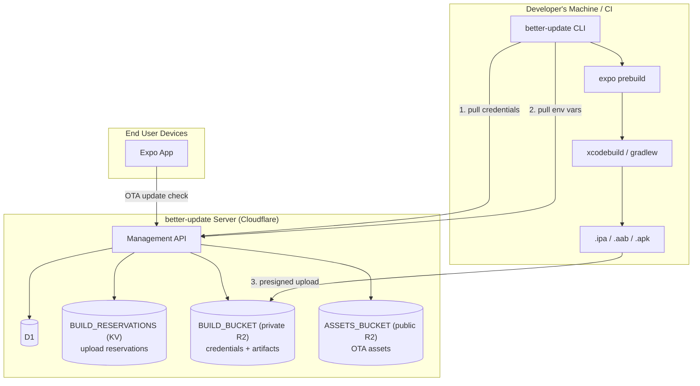
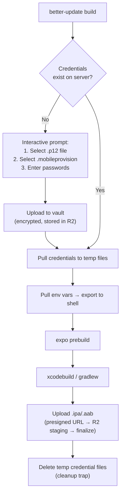
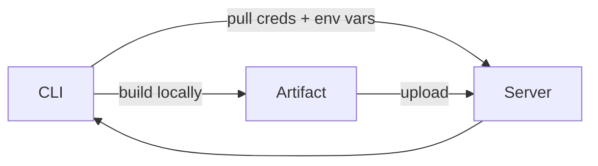

# 1. Architecture

## Overview

better-update's build management provides **centralized credential and env var management + a build registry** for Expo/React Native apps. Builds execute locally on the developer's machine (or their own CI). The CLI pulls credentials and env vars from the server, runs the build, then uploads the artifact back.

This mirrors EAS Build's local mode (`eas build --local`) but without any Expo server dependency.

**Storage separation**: `BUILD_BUCKET` is a **private** R2 bucket for credentials and artifacts — never publicly accessible. `ASSETS_BUCKET` remains the existing **public** R2 bucket for OTA assets served via CDN. These are two separate bindings in `wrangler.jsonc`.

**Artifact upload**: Large artifacts (up to 500 MB) are uploaded directly to R2 via presigned URL, bypassing the Worker's request body limits. The flow is: CLI requests a presigned URL → CLI uploads directly to R2 → CLI calls the server to finalize the build record.

## Scope Boundaries

### What better-update does

- **Credential vault** — store iOS certs/profiles and Android keystores encrypted on the server; CLI pulls them for local builds; interactive provisioning on first build (like EAS)
- **Environment variables** — store per-project per-environment vars on the server; CLI exports them before build
- **Build registry** — store .ipa/.aab/.apk artifacts in R2, track metadata in D1
- **Build history** — list, filter, delete builds per project
- **Artifact distribution** — download links, iOS OTA install (itms-services), QR codes
- **OTA compatibility** — link builds to update channels via runtimeVersion
- **Dashboard** — manage credentials, env vars, builds (like Expo console)

### What better-update does NOT do

- **Execute builds remotely** — builds run on the user's machine or CI, and remote Cloud Build is out of scope
- **Submit to stores** — user submits to App Store / Play Store themselves
- **Manage Apple Developer account** — user creates certs/profiles in Apple Developer portal themselves (better-update stores them, does not create them)

## Request Flows

**First build (no credentials yet):**

**Subsequent builds (credentials exist):**

## Cost Model

| Component                                             | Monthly cost (100 builds) |
| ----------------------------------------------------- | ------------------------- |
| R2 storage (artifacts ~50 MB avg + credentials ~1 MB) | ~$0.75                    |
| D1 reads/writes                                       | Negligible                |
| KV reads/writes (build reservations)                  | Negligible                |
| Worker invocations                                    | Negligible                |
| **Total**                                             | **< $1/month**            |

## Service Mapping

| Service                       | Role                                                                                               |
| ----------------------------- | -------------------------------------------------------------------------------------------------- |
| **Worker**                    | Build management API, credential encryption/decryption                                             |
| **D1**                        | Build metadata, credential metadata, env var storage (including encrypted values)                  |
| **BUILD_BUCKET** (private R2) | Artifact binaries (staging/ + artifacts/ prefixes), encrypted credential blobs                     |
| **BUILD_RESERVATIONS** (KV)   | Transient build upload reservations (3-hour TTL, holds metadata until `/complete` inserts D1 rows) |
| **ASSETS_BUCKET** (public R2) | OTA assets only — unchanged from existing server spec                                              |

### Why Two R2 Buckets

The existing `ASSETS_BUCKET` is a public bucket with CDN caching for OTA asset serving (see [server spec 05](../server/05-asset-serving.md)). Build artifacts and credentials are private data that must never be publicly accessible. Sharing one bucket would require per-prefix access control that R2 does not support — a separate private bucket is the correct boundary.
