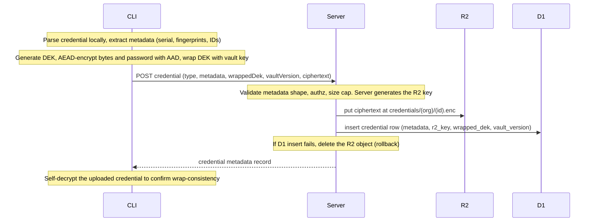

# 2. Credential Vault (End-to-End Encrypted)

## Overview

The credential vault stores iOS and Android signing credentials **end-to-end encrypted**. All
encryption and decryption happen in the CLI, on the user's machine. The server is **zero-knowledge**:
it stores only ciphertext, public keys, and non-sensitive metadata, and is never able to decrypt any
credential. The web dashboard is **read-only** — it shows metadata and access state, and performs no
mutations.

This replaces the previous server-side envelope-encryption design, where the server held a master
secret (`VAULT_KEYRING`) and could decrypt every credential on demand. That capability is removed.

> **Why E2E.** Signing credentials (distribution certificates, push/APNs keys, ASC API keys, Google
> service-account keys, upload keystores) are the most sensitive material a mobile team owns. The
> guarantee here is that a compromise of the better-update server — its database, its R2 bucket, its
> environment — yields only ciphertext and public keys. Plaintext credentials never leave the
> developer's machine, and the server cannot be compelled to produce them.

### Trust model at a glance

| Party                                    | Sees                                                                       | Can decrypt?                                    |
| ---------------------------------------- | -------------------------------------------------------------------------- | ----------------------------------------------- |
| **CLI (local machine)**                  | plaintext credentials, identity private key (passphrase-protected at rest) | Yes — the only place decryption happens         |
| **Server (Cloudflare Worker + D1 + R2)** | ciphertext blobs, wrapped DEKs, public keys, plaintext metadata            | **No**                                          |
| **Web dashboard**                        | metadata + access/recipient state                                          | **No** — read-only, never receives key material |

## Goals & Non-Goals

**Goals**

- The server can never decrypt credentials (no master key, no decryption path).
- All create / edit / upload / delete of credential _material_ happens in the CLI.
- The web dashboard is read-only over public metadata + access state.
- Per-user / per-device key pairs (recipients); a team can grant and revoke access per recipient.
- Store API calls that need a decrypted key (Apple ASC, Google Play) run client-side in the CLI.

**Non-Goals (v1)**

- Server-side builds, server-side store submission, or server-initiated credential use — out of scope
  (see [01-architecture](./01-architecture.md)). Because builds run locally, the CLI is always
  available to decrypt; the server never needs to.
- Server-assisted recovery. The server can never recover a vault — it holds no decryption key.
  Recovery is possible only through an **offline recovery recipient** (see below), a break-glass key
  the org stores offline. Without it, losing every recipient device means re-uploading credentials.
- Full public-key attestation / PKI. v1 uses trust-on-first-use (TOFU) with a manual fingerprint
  check; stronger verification is a later enhancement.

## Credential Types

The set of credential types is unchanged. What changes is the split between **public metadata**
(stored plaintext in D1, shown in the dashboard) and the **secret payload** (encrypted client-side,
stored as an opaque blob in R2). Passwords are folded into the encrypted payload — there are no
separate encrypted-password columns.

### iOS

| Credential               | File               | Public metadata (D1)                                                         | Secret payload (encrypted blob)                             |
| ------------------------ | ------------------ | ---------------------------------------------------------------------------- | ----------------------------------------------------------- |
| Distribution Certificate | `.p12`             | serial, team ID, validFrom/Until                                             | `.p12` bytes **+ password**                                 |
| Push / APNs Key          | `.p8`              | key ID, team ID                                                              | `.p8` PEM                                                   |
| ASC API Key              | `.p8`              | key ID, issuer ID, name, roles, team ID                                      | `.p8` PEM                                                   |
| Provisioning Profile     | `.mobileprovision` | bundle ID, distribution type, profile name, validUntil, team ID, roster hash | profile bytes — **not secret, stored plaintext** (see note) |

> **Provisioning profiles are not secret.** They contain public provisioning data (device UDIDs, team
> info), and EAS treats them the same way. They remain stored plaintext in R2 so the server can keep
> serving them for builds without any decryption. Only the certificate's _private key_ is secret.

### Android

| Credential           | File                 | Public metadata (D1)                     | Secret payload (encrypted blob)                       |
| -------------------- | -------------------- | ---------------------------------------- | ----------------------------------------------------- |
| Upload Keystore      | `.jks` / `.keystore` | key alias, MD5/SHA1/SHA256 fingerprints  | keystore bytes **+ keystore password + key password** |
| Play Service Account | `.json`              | client email, project ID, private key ID | full JSON (contains the RSA private key)              |

Pure binding/grouping rows — **iOS Bundle Configuration**, **Android Build Credentials**, **Apple
Team** — hold no secrets and are unaffected by encryption (they reference credential IDs and store
metadata only).

## Key Architecture

Three layers of keys. Only the bottom two ever touch credential bytes; the top layer is the user's
identity.

```
passphrase ──argon2id──► KEK (local only)
                          │ seals/opens
                          ▼
        identity private key (X25519)  ── ~/.better-update/identity.json (encrypted at rest)
                          │ public half registered on server
                          ▼
        org vault key (32 bytes, symmetric)
          • wrapped to each recipient's public key via age (one row per recipient on the server)
          • never stored unwrapped anywhere except transiently in CLI memory / OS-keychain cache
                          │ wraps
                          ▼
        per-credential DEK (32 bytes)  ──► AES/XChaCha20 of the credential blob (in R2)
```

1. **Identity key pair** — one X25519 key pair per device/install. The private key lives only on that
   machine, encrypted at rest with a key derived from the user's passphrase (Argon2id). The public
   half (an `age1...` recipient string) is registered on the server. Each machine, and each CI runner,
   is its own recipient.
2. **Org vault key** — a random 32-byte symmetric key per organization. It is the root of credential
   encryption. It is wrapped (encrypted) to every authorized recipient's public key and stored as one
   wrap row per recipient. To use the vault, a recipient unwraps it with their identity private key.
3. **Per-credential DEK** — each credential blob is encrypted with its own random 32-byte data key.
   The DEK is wrapped by the org vault key. This indirection means adding or removing a recipient only
   re-wraps the small vault key, never the credential blobs.

> **Shared with environment variables.** Env var **values** use this same org vault key + recipients:
> each value revision is sealed with its own DEK wrapped under the vault key. One grant unlocks both
> credentials and env vars, and a rotation re-wraps both. See
> [03-environment-variables](./03-environment-variables.md).

### Library stack

All cryptography runs in the Node CLI. The server only stores and relays opaque base64 — it links no
crypto library for credential material.

| Concern                                                          | Library                                                                                               | Notes                                                     |
| ---------------------------------------------------------------- | ----------------------------------------------------------------------------------------------------- | --------------------------------------------------------- |
| Wrap vault key → recipient public keys (X25519, multi-recipient) | [`age-encryption`](https://github.com/FiloSottile/typage) (typage)                                    | Standardized age construction; do not hand-roll ECIES     |
| AEAD for credential blobs + DEK wrapping                         | [`@noble/ciphers`](https://github.com/paulmillr/noble-ciphers) — `xchacha20poly1305` + `managedNonce` | 24-byte nonce, random-safe                                |
| Passphrase KDF for the identity key at rest                      | [`@noble/hashes`](https://github.com/paulmillr/noble-hashes) — `argon2id`                             | Node has no Argon2 built in                               |
| OS-keychain caching of the unlocked vault key                    | [`@napi-rs/keyring`](https://github.com/Brooooooklyn/keyring-node)                                    | Prebuilt binaries (no node-gyp); `keytar` is unmaintained |

`age-encryption` depends only on the same `@noble/*` family, so the whole stack is pure-JS, audited,
and free of native build steps — except `@napi-rs/keyring`, which ships prebuilt platform binaries.

The shared crypto lives in the `@better-update/credentials-crypto` package (encrypt/decrypt, wrap/
unwrap, identity seal/open, on-disk formats). Wire schemas (the request/response shapes) live in
`@better-update/api`.

### Encryption details

| Parameter               | Value                                                                                  |
| ----------------------- | -------------------------------------------------------------------------------------- |
| Identity key pair       | X25519 (age identity `AGE-SECRET-KEY-1...` / recipient `age1...`)                      |
| Vault key               | 32 random bytes, symmetric                                                             |
| Vault-key wrapping      | age recipient encryption (one single-recipient blob per recipient)                     |
| DEK                     | 32 random bytes per credential                                                         |
| Blob + DEK AEAD         | XChaCha20-Poly1305, 24-byte random nonce prepended (`managedNonce`)                    |
| Identity-at-rest KDF    | Argon2id, `t=3`, `m=64 MiB`, `p=1`, 16-byte salt, 32-byte output (tune to ~250–500 ms) |
| Identity-at-rest format | JSON envelope `{ v, kdf, kdfParams, salt, cipher, ct }`                                |

The identity file (`~/.better-update/identity.json`, mode 0600) stores the X25519 private key sealed
with the passphrase-derived key:

```jsonc
{
  "v": 1,
  "publicKey": "age1...", // also registered on the server
  "fingerprint": "SHA256:...", // shown for out-of-band verification
  "kdf": "argon2id",
  "kdfParams": { "t": 3, "m": 65536, "p": 1 }, // m in KiB
  "salt": "<base64, 16 bytes>",
  "cipher": "xchacha20poly1305",
  "ct": "<base64: nonce ‖ sealed private key>",
}
```

The seal's AEAD binds (as AAD) the public key, fingerprint, and KDF params; on open the CLI re-derives
the public key from the decrypted private key and aborts on mismatch, so a tampered or swapped identity
file is rejected.

### Envelope & authenticity binding

The server stores `{ R2 blob, wrapped DEK, vault_version, metadata }` as separate client-supplied fields
and cannot verify their relationship. To stop a compromised server (or a buggy client) from mixing them
— serving credential A's blob under credential B's metadata, or binding an ASC key to the wrong Apple
team — the binding is enforced **cryptographically**, not by trusting the rows:

- **Typed secret payload** — the blob plaintext is a typed, versioned struct, not raw bytes:
  `{ schemaVersion, orgId, credentialId, credentialType, metadata, secret }`. The authoritative copy of
  the metadata lives _inside_ the ciphertext.
- **Blob AEAD AAD** = `orgId ‖ credentialId ‖ credentialType ‖ schemaVersion`. A blob encrypted for one
  (org, credential, type) cannot be decrypted under any other — the AEAD tag fails.
- **Wrapped-DEK AAD** = `orgId ‖ credentialId ‖ vaultVersion`. A DEK wrap cannot be replayed under a
  different credential or a stale vault version.
- **Decrypt-time check** — after decryption the CLI re-derives metadata from the typed payload and
  **fails hard** if it differs from the server-supplied metadata row (build/store flows refuse to
  proceed). Plaintext provisioning profiles carry a stored `sha256` + parsed metadata that is
  re-verified.

Swapping any of {blob, DEK wrap, metadata row, credential id, org, vault version} therefore breaks
decryption rather than silently yielding the wrong credential.

## Identities & Recipients

### Registration

On first use (`better-update credentials identity init`, or lazily on the first credential operation),
the CLI:

1. Generates an X25519 identity key pair.
2. Prompts for a passphrase, derives a KEK (Argon2id), seals the private key into `identity.json`.
3. Registers the public recipient on the server with a device label and the key fingerprint.

Server table `user_encryption_keys`: `{ id, user_id (nullable), organization_id (nullable), kind
(device|recovery|machine), public_key (age1...), label, fingerprint, created_at, last_used_at,
revoked_at }`. Public keys are safe for the server to hold. A `device` key is user-owned (`user_id`
set, `organization_id` null) and works across the user's orgs via per-org wraps; `recovery` and
`machine` keys are org-owned (`organization_id` set, no `user_id`).

A single device identity can be a recipient in **multiple orgs** — each org wraps its own vault key to
the same public key. `user_encryption_keys` is global per user/device; `org_vault_key_wraps` is per
(org, recipient). CLI credential commands resolve the active org from the project id, which is itself
resolved **build-system-agnostically** — `BETTER_UPDATE_PROJECT_ID` env > `better-update.json` >
Expo config (`extra.betterUpdate.projectId`, lazy/optional `@expo/config`). The vault is not tied to
Expo: the credential types are standard Apple/Android signing artifacts (.p12, .p8, .mobileprovision,
.jks, service-account .json) equally valid for KMP, Flutter, and native projects, which can use the
vault without an `app.json`.

### Granting access (the recipient model)

An org's vault key is wrapped to each authorized recipient. The wrap rows live in
`org_vault_key_wraps`: `{ org_id, vault_version, user_encryption_key_id, wrapped_key (age blob),
created_at }` — one row per recipient.

- **Bootstrap** — the first member runs `credentials identity init` for the org: it generates the org
  vault key locally, writes a wrap row for their own recipient, **and generates the org recovery
  recipient** (see below), wrapping the vault key to it too. The recovery private key is shown once for
  offline storage. A credential operation against a not-yet-bootstrapped vault fails with guidance to
  run `init` first — the CLI does **not** silently bootstrap mid-upload, which would bury the one-time
  recovery key in command output and leak it into CI logs. _(Lazy auto-bootstrap on first upload is a
  deferred convenience; if added it must be interactive-only with an explicit recovery-key
  acknowledgement, never in non-interactive/CI runs.)_
- **Grant another user** — a new member registers their public key, then an existing recipient who is
  an **org admin/owner** runs `credentials access grant <user>`: the CLI unwraps the vault key with its
  own identity, re-wraps it to the new recipient's public key, and uploads the new wrap row. The server
  never has the unwrapped vault key — it only enforces the authz rule below before accepting the row.
  **One grant unlocks every credential, past and future** — all DEKs are wrapped by the one vault key,
  not per recipient.
- **Add / switch your own device** — a new device of an existing member registers its key, then one of
  that member's _existing_ devices (which already holds the vault key) wraps it to the new device:
  `credentials device link`. This is **self-service, no admin needed**, because it adds no new person
  and requires possession of an existing device's private key. Losing _all_ of your devices falls back
  to an admin grant or the recovery key. (A new device is always a new key pair — private keys are
  never synced across machines; that is the point of the per-device model.)
- **CI / machine** — a CI runner is an org-owned **machine recipient** (`kind=machine`, no `user_id`),
  granted once by an admin, and runs fully non-interactively. See the CI / automation section below.

**Authz rule for accepting a wrap row** — the server accepts a new wrap row when either (a) the target
encryption key belongs to the **caller's own user** (self-linking your own device — any member), or (b)
the caller is an **org admin/owner** (granting another user, or a CI machine key). All accepted grants
are audit-logged. The server cannot verify a wrap is correct (it is opaque), but an invalid wrap is
simply undecryptable — only a wrap produced with the real vault key works, which requires possession of
an existing recipient's private key. So a stolen account alone (no existing device) cannot usefully
self-link.

A member with a registered key but no wrap row can see metadata but cannot decrypt — the dashboard and
CLI show them as **pending access**.

### Revoking & rotating

**Revoke always rotates** (v1 decision). A soft revoke that only removed a wrap row would not actually
revoke — a removed recipient that had cached or copied the vault key could still decrypt every existing
credential (their DEKs are still wrapped under the old vault key). So `credentials access revoke
<recipient>`, run by an admin who holds the current key, performs an atomic rotation:

1. Generate a **new vault key** (version `v+1`) locally.
2. Unwrap every credential's DEK with the old vault key and **re-wrap it under the new key**.
3. Re-wrap the new vault key to every **remaining** recipient (plus the recovery key); drop the revoked
   recipient's wrap row.
4. Upload the new wrap rows + the bulk DEK update + the new `vault_version` in **one atomic repository
   method**, guarded by compare-and-swap on `org_vaults.vault_version` (the authoritative per-org current
   version). The rotation is **rejected unless it covers every credential row at the old version** — a
   partial rotation is refused, so no credential can be left decryptable by the old key.

Afterwards the old vault key is useless going forward — the revoked key can no longer decrypt any
credential, old or new. Cost is O(credentials) DEK re-wraps, which is small (credentials are few).
`credentials access rotate` runs the same flow without removing anyone (periodic hygiene).

**Concurrency** — `org_vaults.vault_version` is the single source of truth. Rotation and upload both
carry the version they read; the server accepts a write only if it still matches (compare-and-swap), and
a loser retries against the new version. A credential `finalize` carrying a stale `vault_version` is
rejected (the CLI re-wraps the DEK under the current key and retries). D1 runs the rotation as one
transaction; if the credential set ever outgrows a single D1 transaction, rotation chunks with the
version CAS as the guard so a partial run cannot publish.

**Caveat** — rotation cannot un-see what a recipient already decrypted while they had access. To fully
cut off a departed member, also rotate the underlying credential at Apple/Google (regenerate the
certificate / keys / keystore) — an out-of-band operation.

### Verification & fingerprint pinning (TOFU)

When granting access, the granting client trusts the public key the server returns for the new recipient
— a malicious server could substitute its own key, or inject an extra recipient into the set a rotation
re-wraps to. Mitigations:

- **Fingerprint confirmation** — `grant`, `device link`, `recover`, and recovery rotation display the
  target key **fingerprint** for out-of-band verification (chat, in person) before wrapping to it.
- **Local pinning** — the CLI pins the recipient fingerprints it has seen per org. **Rotation re-wraps
  only to pinned recipients**; any previously-unseen recipient in the server's list requires explicit
  confirmation before the vault key is wrapped to it. This stops a server from silently adding itself as
  a recipient during a re-wrap.

Full attestation / PKI is a later enhancement; pinning + confirm-on-new is the v1 bar.

### Recovery recipient (break-glass)

The org has one **recovery recipient** — a key pair generated at bootstrap whose public half is a
permanent recipient of the vault, and whose private half is **shown once and stored offline** by the
org (printed, or in a separate offline password manager / safe). It is never written to disk or sent to
the server. Because its public key is an ordinary recipient, every rotation re-wraps the vault key to it
automatically.

- **Purpose** — break-glass when no device holds the vault key anymore (everyone lost their identity
  keys / passphrases) but the org still has admin accounts.
- **Recover** — an authenticated admin runs `credentials access recover` and pastes/loads the offline
  recovery private key; the CLI unwraps the vault key with it, re-wraps to the admin's fresh identity,
  and uploads a new wrap row. Normal access is restored — **no credential re-upload needed**.
- **Rotate** — `credentials access recovery rotate` generates a new recovery key (shown once) if the
  offline copy is lost or suspected compromised; the old one is revoked and the vault re-wrapped.
- **Tradeoff** — the recovery key can decrypt everything; its safety rests entirely on staying offline.
  It appears in the Access view as a distinct `recovery` recipient so its presence is always visible.

### CI / automation

CI runs with no human, often on an ephemeral runner, so it cannot type a passphrase or use the OS
keychain. A runner is set up once as a dedicated **machine recipient**.

**One-time setup (an admin):**

1. `credentials identity create --ci` generates a machine key pair and prints the private key
   (`AGE-SECRET-KEY-1...`) **once**. There is no interactive passphrase — the CI platform's encrypted
   secret store is the protection boundary.
2. Store that private key as a masked CI secret: `BETTER_UPDATE_IDENTITY`.
3. The admin grants the machine key (`credentials access grant <machine>`) — admin-gated, since a
   machine key is org-owned (no `user_id`) and cannot self-link.
4. Store a build-scoped, non-admin API token as `BETTER_UPDATE_TOKEN` (least privilege).

**Each run (non-interactive):** the CLI reads both env values, skips the keychain, fetches the machine
recipient's wrapped vault key, unwraps it with the env-provided identity, then resolves + decrypts build
credentials into the temp dir exactly as a local build does. Nothing persists on the runner.

```
BETTER_UPDATE_TOKEN     → API auth (who you are)            ── existing
BETTER_UPDATE_IDENTITY  → encryption private key (decrypt)  ── new
```

**Two independent secrets (defense in depth)** — the token alone yields only ciphertext + metadata (the
server cannot decrypt); the identity alone is useless without API access to fetch the wrapped vault key.
An attacker needs **both** to recover a credential.

**Least privilege (with a caveat)** — a machine recipient is not an admin, so it cannot grant others or
(no `user_id`) self-link devices, and credential creation/rotation stays a human action. But the vault
key is **org-wide**: a machine recipient that unwraps it can decrypt _every_ credential the server
returns for that org. A build-scoped API token limits what the API hands out, but that is authorization,
not cryptographic scoping. Label machine recipients by org / project / environment; true per-project
isolation would need separate per-project vault keys (a later enhancement).

**If a CI secret leaks** — revoke the machine recipient (`credentials access revoke <machine>`) and
rotate the vault key; rotate the underlying Apple/Google credential if you believe it was actually
exposed.

**Honest caveat** — any system that builds with signing credentials must read them at build time, so a
CI pipeline you authorize can necessarily decrypt the credentials it builds with. E2E protects against a
**server** compromise (the server can never decrypt); it does not hide credentials from a build runner
you have deliberately granted.

## Upload Flow (CLI → encrypted → server-relay to R2)

The CLI does all parsing, metadata extraction, and encryption locally, then sends the **encrypted blob**
to the server, which relays it straight into R2 and writes the D1 row in one atomic handler. Credential
blobs are small (KB–a few MB, well under the Worker body limit), so there is no need for the presigned
staging dance that large build artifacts use — and routing through the Worker means there is no
presigned URL that could overwrite a finalized credential. The Worker still **never sees plaintext**:
the body is ciphertext, opaque to it.



The request body carries **metadata + wrappedDek + vaultVersion** only — never key material. Because
the server can no longer read the blob, it cannot extract metadata; the CLI supplies it (the CLI
already parses `.p12` via `@expo/pkcs12`, computes fingerprints, etc.). The server validates the
_shape_ of the metadata and authorizes the request, but trusts the values (they are public).

**Uploading requires vault access.** To wrap the new credential's DEK, the uploader needs the org vault
key — so they must be a granted recipient. A pending-access member cannot upload (only view metadata);
the first member bootstraps the vault on their first upload. The upload carries the current
`vaultVersion`; if a rotation landed first, the server rejects on the version guard and the CLI re-wraps
the DEK under the new key and retries.

**Why server-relay, not presigned.** The **server generates the R2 key** (`credentials/{org}/{id}.enc`)
— the client never chooses it, so it cannot write into another org's namespace. The write is one atomic
handler (R2 `put` then D1 insert; on D1 failure the R2 object is deleted), so there is no staging prefix,
no `finalize` step, no orphaned-object cleanup cron, and no still-valid presigned URL that could
overwrite a finalized blob. The server enforces a size cap but does **not** hash or read the blob for
content — integrity is the AEAD tag's job (tampering fails decryption), and the CLI self-decrypts right
after upload to confirm the credential is wrap-consistent. (Large build artifacts keep their presigned
flow — see [06-artifact-management](./06-artifact-management.md) — credentials are small enough not to.)

## Download & Build Resolve (encrypted → CLI decrypts)

Before each local build, the CLI resolves and decrypts credentials into a temporary directory.

```
1. Unlock identity (passphrase → open identity.json) — or read cached vault key from OS keychain.
2. GET org vault wrap for this recipient → age-unwrap with identity → vault key (cache w/ TTL).
3. POST /api/projects/:id/build-credentials/resolve
      → server checks bindings/team consistency on METADATA, returns per asset:
        { metadata, ciphertext (relayed from R2 by the Worker), wrappedDek, vaultVersion } — no plaintext
4. CLI: unwrap DEK with vault key (AAD-checked) → decrypt blob → re-verify metadata matches.
5. Write into a unique per-build temp dir (mode 0700):
      $BUILD_DIR/cert.p12, $BUILD_DIR/profile.mobileprovision, keystore, …
6. iOS: import .p12 into an ephemeral keychain ("better-update-<random>"); Android: export env vars.
7. Register cleanup trap (SIGINT/SIGTERM/EXIT): delete $BUILD_DIR + ephemeral keychain.
8. Run build. 9. Cleanup fires.
```

**Crash recovery** — on startup the CLI sweeps `$TMPDIR/better-update-*` directories older than 1 hour
and the OS-keychain cache entry honors its TTL.

`resolve` still performs all the binding and consistency logic (project-scoped vs org-wide selection,
distribution-type matching, bundle-ID and team-ID matching, expiry warnings, roster-hash staleness for
managed profiles) — all on **metadata**, which is plaintext. It just returns ciphertext (relayed
through the Worker from R2) instead of decrypted bytes.

## Store API Calls (Apple ASC, Google Play) — client-side

Operations that need a _decrypted_ store key run entirely in the CLI:

- Apple App Store Connect (device sync, profile regeneration, managed credentials): the CLI decrypts
  the ASC `.p8` locally and calls Apple directly. The previous server-side `asc-api-keys/:id/sync-
devices` endpoint (which decrypted server-side) is **removed**.
- Google Play (service-account-driven uploads): the CLI decrypts the service-account JSON locally and
  calls Google directly.

The server stores only the encrypted keys and the resulting records (e.g. device roster, submission
metadata). This matches the established direction of keeping store API calls client-side.

## Passphrase / Unlock UX

The identity private key is unlocked with the user's passphrase. To avoid re-typing it every command,
the CLI caches the **unlocked vault key** (not the passphrase) in the OS keychain with a TTL.

| Mode                         | Behavior                                                                                                                                                                                                                                            |
| ---------------------------- | --------------------------------------------------------------------------------------------------------------------------------------------------------------------------------------------------------------------------------------------------- |
| **Keychain cache (default)** | First decrypt in a session prompts for the passphrase, unlocks the identity, fetches + unwraps the vault key, and caches it in the OS keychain (`@napi-rs/keyring`) with a TTL. Subsequent commands read the cached key until it expires.           |
| **Prompt**                   | `--no-cache` (or no OS keychain available) prompts every time a decrypt is needed.                                                                                                                                                                  |
| **CI / non-interactive**     | The encryption identity private key is provided via `BETTER_UPDATE_IDENTITY` (no passphrase — the CI secret store is the protection boundary) and the API token via `BETTER_UPDATE_TOKEN`; no prompt, no keychain. See the CI / automation section. |

The cache stores `{ key, exp }`; once `Date.now() > exp` the entry is treated as missing and deleted.
The bearer auth token (`~/.better-update/auth.json`, mode 0600) is unchanged and separate from the
encryption identity.

## Web Dashboard (read-only)

The dashboard shows credential **metadata** and **access state** only. It performs no create, upload,
edit, bind/unbind, delete, or sync. Where the old UI had mutation dialogs, the new UI shows the value
plus a hint that changes are made via the CLI (e.g. `better-update credentials …`).

Displayed metadata (all already non-sensitive): certificate serial + expiry + status badge, push/ASC
key IDs and issuer, team info, keystore alias + fingerprints, service-account email + project ID,
provisioning profile name + expiry + bundle ID.

New **Access** view per organization: the list of recipients (users / devices / CI / the offline
**recovery** key) that can decrypt the vault, each with its key fingerprint, label, kind, and last-used
time; plus members in **pending access** (registered key, not yet granted). This view is read-only;
grant / revoke / recover happen in the CLI.

## Migration (clean break)

Production has no real users yet, so no backward compatibility is required.

- A migration drops the server-side-encryption columns (`encrypted_dek`/`dek_key_version`,
  `encrypted_password`/`password_key_version`, the Android `encrypted_keystore_password` /
  `encrypted_key_password` and their versions) and adds `wrapped_dek` + `vault_version`; it creates the
  new `user_encryption_keys`, `org_vault_key_wraps`, and `org_vaults` (authoritative `vault_version` per
  org) tables.
- Existing credential rows and their R2 blobs were encrypted under the old server key and cannot be
  re-keyed without plaintext — credential tables are **truncated** (cascading to the binding rows that
  reference them: iOS bundle configurations and Android build-credential groups), and their R2 objects
  are removed by a one-off cleanup script (D1 migrations don't touch R2). Users re-upload via the CLI.
- The `VAULT_KEYRING` secret and the `Vault` / credential-vault crypto code are removed (see
  [03-environment-variables](./03-environment-variables.md)).

## Security Considerations

| Concern                        | Mitigation                                                                                                                                                                                                                                         |
| ------------------------------ | -------------------------------------------------------------------------------------------------------------------------------------------------------------------------------------------------------------------------------------------------- |
| Credential at rest (server)    | Client-encrypted; server is zero-knowledge (no master key, no decryption path)                                                                                                                                                                     |
| Credential in transit          | Ciphertext only, over TLS; relayed through the Worker to R2 (the Worker sees ciphertext, never plaintext)                                                                                                                                          |
| Credential on local disk       | Decrypted only into a 0700 temp dir during a build, deleted after; identity key sealed with Argon2id                                                                                                                                               |
| Identity private key           | Stored encrypted at rest (Argon2id + XChaCha20-Poly1305); never uploaded                                                                                                                                                                           |
| Vault-key cache                | Held in the OS keychain with a TTL, not in plaintext files                                                                                                                                                                                         |
| Dashboard exposure             | Read-only; the dashboard never receives key material                                                                                                                                                                                               |
| Lost access (recovery)         | Offline recovery recipient (break-glass) restores access without re-upload; also keep ≥2 live recipients (e.g. a personal machine + a CI key)                                                                                                      |
| Recovery-key escrow            | The recovery private key can decrypt everything — kept **offline only** (never on server/disk), shown once at bootstrap, visible as a distinct recipient in the Access view                                                                        |
| Grant authority                | Granting another user / CI key is gated to org admin/owner (audit-logged); self-linking your _own_ new device is self-service (target key must share your user_id, and requires an existing device that holds the vault key)                       |
| Pubkey substitution (TOFU)     | Fingerprint shown at grant time for out-of-band verification                                                                                                                                                                                       |
| Server trusts client metadata  | Metadata is public; server validates shape + authz. Cross-credential mix-ups are prevented cryptographically (AEAD AAD binds ciphertext to org + credentialId + type; the DEK wrap binds vault_version; decrypt re-checks metadata and fails hard) |
| Recipient injection on re-wrap | Client pins recipient fingerprints per org; rotation re-wraps only to pinned keys; previously-unseen recipients need explicit confirmation                                                                                                         |
| Departed team member           | Revoke always rotates the vault key (re-wraps all DEKs, drops their wrap); rotate underlying Apple/Google credentials for full cutoff                                                                                                              |

## Operational details

- **Onboarding** — `better-update login` authenticates; the first credential operation triggers
  `credentials identity init` (generate key, seal with passphrase, register public key). Until an admin
  grants access (or the user self-links from another device), the user is **pending** — metadata-visible,
  decrypt-blocked. `last_used_at` updates on each successful unwrap.
- **Account / device / member lifecycle** — removing a member or device drops their wrap row immediately
  (cuts off re-fetch), but that alone is _not_ full revocation if they cached the vault key, so removal
  flags the vault **rotation-pending** and an admin must `revoke` / `rotate` to re-key. Deleting a
  credential must also remove its R2 blob + wrapped DEK; deleting an org purges all wraps, keys, blobs,
  and the recovery recipient.
- **Changing the passphrase** — `credentials identity passphrase change` re-seals `identity.json`
  locally only; it never touches the server or the vault key. A forgotten passphrase loses that
  _device's_ access (treat as a lost device — re-link or admin-grant), **not** the vault.
- **Keyring unavailable** — if the OS keychain backend is missing (e.g. headless Linux without
  libsecret) or has no prebuilt binary, the CLI degrades to prompt / env input and never crashes.
- **Metadata is intentionally server-visible** — the full metadata set (serials, key IDs, issuer IDs,
  client email, team IDs, bundle IDs, keystore fingerprints, profile UDIDs) is stored plaintext so the
  dashboard can display it. After decrypting, the CLI re-derives metadata from the plaintext and warns
  if it diverges from what the server holds.
- **Audit** — grant, revoke, recover, rotate, upload, delete, and resolve/download are all audit-logged.
- **Profile regeneration under E2E** — when `resolve` flags a managed profile stale (device roster
  changed), the CLI decrypts the ASC key locally, calls Apple to regenerate, and uploads the new profile
  (profiles are plaintext, so it is a metadata + blob upload). All Apple/Google calls stay client-side.
- **Integrity** — every blob and wrapped DEK is AEAD (XChaCha20-Poly1305), so tampering fails decryption
  (the server stores opaque ciphertext and never hashes it); the upload handler enforces a size cap and
  writes R2 + D1 atomically, and the CLI self-decrypts after upload as the real consistency check.
- **Local key hygiene** — the OS-keychain cache entry is namespaced by `orgId + recipientKeyId +
vaultVersion` (a rotation invalidates it) with a short TTL; `credentials lock` clears it on demand.
  Decrypted keys live in `Uint8Array`s and are zeroed best-effort after use.
- **Upload-garbage is DoS, not a breach** — a token-only attacker (no vault key) can store an
  undecryptable blob but cannot read anything. The CLI self-decrypts right after upload to prove the
  credential is wrap-consistent, the result is audited, and the dashboard surfaces a broken-credential
  health state.

## Affected Components

| Area                                | Change                                                                                                                                                                                                                                                                                                                                                                 |
| ----------------------------------- | ---------------------------------------------------------------------------------------------------------------------------------------------------------------------------------------------------------------------------------------------------------------------------------------------------------------------------------------------------------------------- |
| `@better-update/credentials-crypto` | New: wrap/unwrap, blob AEAD, identity seal/open, on-disk formats                                                                                                                                                                                                                                                                                                       |
| `@better-update/api`                | Reshape upload/download/resolve schemas; add `userEncryptionKeys` + `orgVault` groups                                                                                                                                                                                                                                                                                  |
| `apps/server`                       | New tables/repos/handlers (keys incl. `kind=recovery`, vault wraps; wrap-row authz = own-device self-link OR admin/owner, audited); credential repos store ciphertext refs; remove `Vault`, `credential-vault`, `VAULT_KEYRING`, server-side ASC sync; `resolve` returns ciphertext                                                                                    |
| `apps/cli`                          | `IdentityStore` + keychain cache; encrypt-on-upload + metadata extraction; decrypt-on-build; `credentials identity`, `credentials device link`, `credentials configure` (bind cert/profile/push/ASC/keystore to a bundle config or build-cred group — web is read-only), `credentials access` (grant / revoke / recover / recovery rotate); client-side ASC/Play calls |
| `apps/web`                          | Remove all credential mutations; read-only metadata + Access view                                                                                                                                                                                                                                                                                                      |

See [09-implementation-plan](./09-implementation-plan.md) for sequencing.
