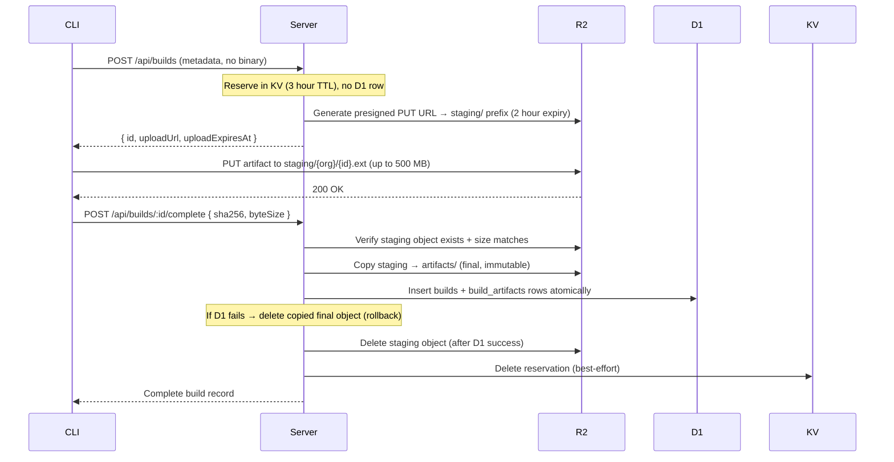

# 6. Artifact Management

## Storage Layout

```
BUILD_BUCKET (private R2, separate from public ASSETS_BUCKET):
  staging/                          ← presigned upload target (temporary)
    {org_id}/
      {build_id}.{ext}             ← deleted after /complete promotes to artifacts/
  artifacts/                        ← finalized, immutable after /complete
    {org_id}/
      {build_id}.ipa
      {build_id}.aab
      {build_id}.apk
      {build_id}.tar.gz
  credentials/
    {org_id}/
      {credential_id}
```

## Supported Formats

| Format    | Platform | Use case                          | Typical size |
| --------- | -------- | --------------------------------- | ------------ |
| `.ipa`    | iOS      | Device / App Store / TestFlight   | 30–80 MB     |
| `.aab`    | Android  | Google Play                       | 15–60 MB     |
| `.apk`    | Android  | Direct install / sideload         | 20–80 MB     |
| `.tar.gz` | iOS      | Simulator build (.app compressed) | 40–100 MB    |

Max upload size: **500 MB** (sanity check — real Expo apps are far smaller).

## Metadata — Client-Supplied (v1)

In v1, **all build metadata is provided by the CLI** in the `POST /api/builds` request. Server-side extraction from binary artifacts is deferred to a future enhancement.

**Why client-supplied**: Cloudflare Workers' `DecompressionStream` supports `deflate`/`gzip` but not ZIP archive format. Parsing `.ipa` (ZIP + binary plist), `.apk` (ZIP + binary XML), and `.aab` (ZIP + protobuf) inside a 128 MB Worker isolate is impractical without heavy WASM dependencies. The CLI already has the native tooling available.

### What the CLI provides

| Build column     | iOS source                               | Android source                          |
| ---------------- | ---------------------------------------- | --------------------------------------- |
| `bundle_id`      | `app.json` → `expo.ios.bundleIdentifier` | `app.json` → `expo.android.package`     |
| `app_version`    | `app.json` → `expo.version`              | `app.json` → `expo.version`             |
| `build_number`   | `app.json` → `expo.ios.buildNumber`      | `app.json` → `expo.android.versionCode` |
| `runtimeVersion` | Resolved from policy (see below)         | Resolved from policy (see below)        |

Additional metadata (stored in `metadata_json`):

| Field          | iOS source                               | Android source                            |
| -------------- | ---------------------------------------- | ----------------------------------------- |
| `minOsVersion` | `app.json` → `expo.ios.deploymentTarget` | `app.json` → `expo.android.minSdkVersion` |
| `displayName`  | `app.json` → `expo.name`                 | `app.json` → `expo.name`                  |
| `xcode`        | `xcodebuild -version` output             | —                                         |
| `minSdk`       | —                                        | `app.json` → `expo.android.minSdkVersion` |

### runtimeVersion resolution

The CLI resolves `runtimeVersion` before upload based on the configured policy:

```bash
# Fingerprint policy (computed hash)
npx @expo/fingerprint .

# Static string policy (literal value)
npx expo config --json | jq -r '.runtimeVersion'

# appVersion policy (computed from expo.version)
npx expo config --json | jq -r '.version'

# nativeVersion policy (platform-specific build number)
# iOS: npx expo config --json | jq -r '.ios.buildNumber'
# Android: npx expo config --json | jq -r '.android.versionCode'
```

### Future: Server-Side Extraction

A future phase may add optional server-side metadata extraction as a verification step — comparing client-supplied metadata against values extracted from the uploaded binary. This would use a WASM-based ZIP parser or a secondary service outside the Worker.

## Upload Flow (Presigned URL)

Artifacts are uploaded directly to `BUILD_BUCKET` via presigned R2 URLs, bypassing the Worker's request body limits (Cloudflare Workers have a 100 MB limit on request bodies).



If the `/complete` call never arrives (client crash), only an orphaned R2 staging object and an expiring KV entry remain — no dangling D1 rows. The daily Cron handler cleans up R2 objects under `staging/` older than 2 hours.

## Integrity Verification

| Check              | When        | How                                                                                                                          |
| ------------------ | ----------- | ---------------------------------------------------------------------------------------------------------------------------- |
| Upload size        | On finalize | Server verifies `byteSize` matches R2 object `size` — rejects if mismatch                                                    |
| Content hash       | On finalize | CLI computes SHA-256 locally, sends in `/complete` request; server stores as **client-reported** in `build_artifacts.sha256` |
| Download integrity | Client-side | Client can re-compute SHA-256 after download and compare against `build_artifacts.sha256`                                    |

**Note**: The server does not independently verify the SHA-256 hash against the R2 object content. Streaming a 500 MB object through a Worker isolate for hashing would exceed memory/CPU limits. The `byteSize` check provides a basic tamper signal; the SHA-256 is stored for client-side verification only.

## Download

`GET /api/builds/:id/artifact` generates a **presigned R2 URL** (15-minute expiry) and returns a 302 redirect. Benefits:

- No Worker streaming overhead for large files
- CDN caching at R2 edge
- Download URL is temporary — cannot be shared permanently

## Install Links

### iOS Ad-Hoc Install

iOS devices can install `.ipa` files over HTTPS via Apple's `itms-services://` protocol. Requirements:

- HTTPS URL serving a manifest `.plist` (see [API spec](./05-api-endpoints.md))
- The `.ipa` must be signed with an ad-hoc or enterprise provisioning profile
- Ad-hoc builds require the device's UDID in the provisioning profile

The dashboard generates:

1. A signed install URL with short-lived HMAC token (1-hour expiry, scoped to buildId — see [API spec](./05-api-endpoints.md))
2. A QR code encoding the `itms-services://` link
3. The manifest plist embeds a **fresh presigned R2 download URL** generated at request time

User flow: open QR code on iPhone → Safari → "Install app?" → installs.

### Android APK Install

Since the artifact download endpoint (`GET /api/builds/:id/artifact`) requires authentication, direct browser downloads need a **signed public download URL** — the same HMAC token mechanism used for iOS install links.

URL format: `GET /api/builds/:id/artifact?token=<base64>&expires=<unix>`

When a valid signed token is present, the endpoint bypasses auth and returns the presigned R2 redirect. Token expiry: 1 hour, scoped to buildId. Only `distribution: "direct"` builds are eligible.

User flow: open QR code on Android → browser downloads APK → installs (must enable "Install from unknown sources").

### QR Code

Dashboard shows a QR code for each build. The QR encodes:

- iOS ad-hoc/enterprise: `itms-services://` URL (signed token)
- iOS App Store: not applicable (install from TestFlight)
- Android APK: signed public download URL (same HMAC token mechanism)
- Android AAB: not applicable (install from Play Store)

## Dashboard UI

### Build List Page

```
/projects/:projectId/builds

┌──────────────────────────────────────────────────────────────┐
│ Builds                                    [iOS ▾] [All ▾]   │
├──────────────────────────────────────────────────────────────┤
│ #42  iOS   production  v1.2.0 (42)   52 MB   2 hours ago  ↓ │
│ #41  AND   production  v1.2.0 (12)   35 MB   2 hours ago  ↓ │
│ #40  iOS   preview     v1.1.9 (41)   48 MB   1 day ago    ↓ │
│ #39  AND   preview     v1.1.9 (11)   30 MB   1 day ago    ↓ │
└──────────────────────────────────────────────────────────────┘
```

Filterable by platform, profile. Sortable by date.

### Build Detail Page

```
/projects/:projectId/builds/:buildId

┌──────────────────────────────────────────────────────────────┐
│ Build #42 — iOS production                                   │
├──────────────────────────────────────────────────────────────┤
│ Bundle ID:       com.example.app                             │
│ Version:         1.2.0 (42)                                  │
│ Runtime Version: abc123def...                                │
│ Profile:         production                                  │
│ Size:            52 MB                                       │
│ Git:             main @ abc1234                               │
│ Message:         v1.2.0 release build                        │
│ Uploaded:        Apr 11, 2026 12:00 PM                       │
│                                                              │
│ Compatible OTA channels:                                     │
│   ✓ production — 3 updates                                   │
│   ✓ staging — 1 update                                       │
│                                                              │
│ [Download .ipa]  [Install on Device]  [QR Code]  [Delete]    │
└──────────────────────────────────────────────────────────────┘
```
