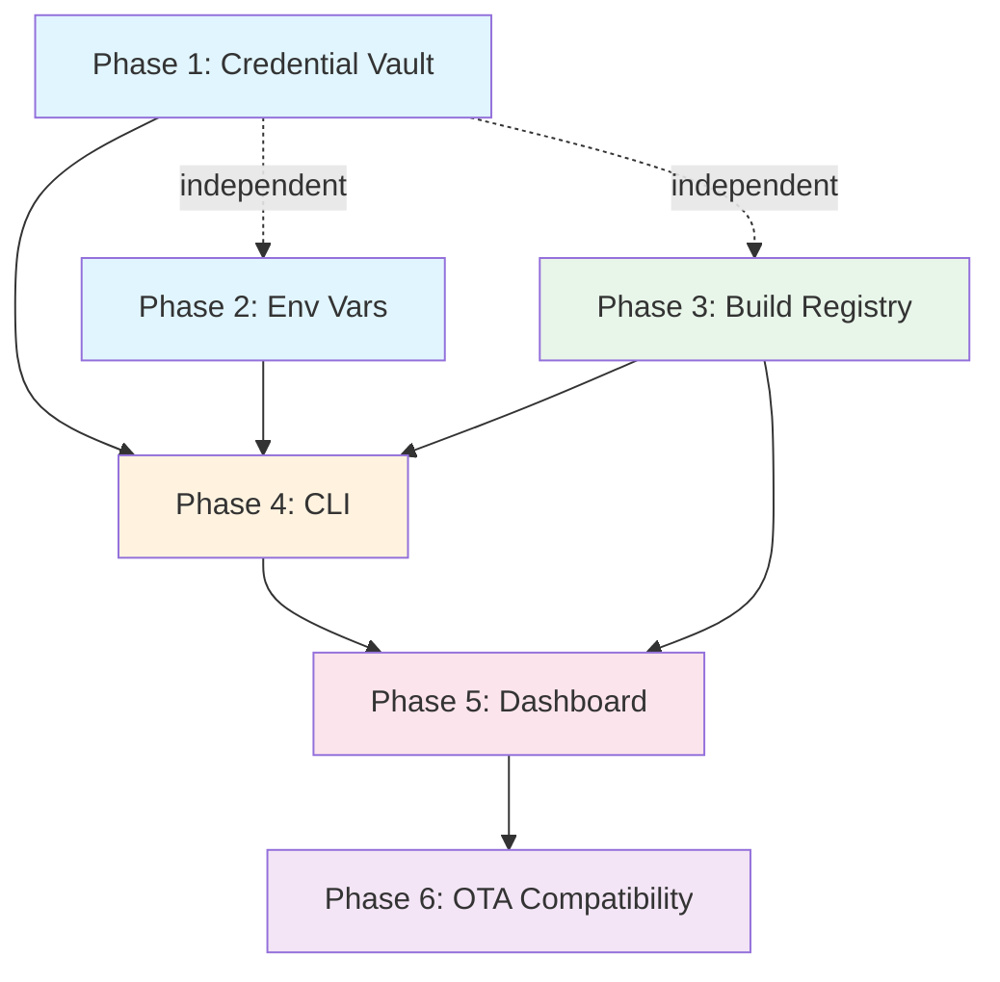

# 9. Implementation Plan

## Phased Delivery

### Phase 1: Credential Vault

**Goal**: Store and manage signing credentials securely.

**Deliverables**:

- Wrangler config: versioned vault keyring — either `VAULT_KEYRING` (JSON secret: `{"1":"<base64>"}`) or individual `VAULT_SECRET_V1` secrets, plus `CURRENT_KEY_VERSION` (see [02-credential-vault.md](./02-credential-vault.md)). Dedicated and separate from `BETTER_AUTH_SECRET`.
- D1 migration: `credentials` table (with `key_version` column)
- Credential encryption service (AES-256-GCM, HKDF key derivation with versioned KEK, envelope encryption)
- R2 storage: encrypted blobs in `BUILD_BUCKET` at `credentials/{org_id}/{credential_id}`
- Metadata storage from CLI-supplied fields (commonName, expiry, teamId, bundleId, profileType, keyAlias); server-side extraction from binary formats (.p12, .mobileprovision, .jks) deferred to future enhancement
- API endpoints: `POST/GET/DELETE /api/credentials`, `GET /api/credentials/:id/download`, `POST /api/credentials/:id/activate`
- Effect HttpApiGroup: `CredentialsGroup`
- Domain schemas: `Credential`, `CreateCredentialBody`
- Unit tests for encryption/decryption logic

**Acceptance criteria**:

- Upload `.p12` → metadata extracted best-effort or CLI-supplied (commonName, expiry, teamId), blob encrypted in R2
- Upload `.jks` → metadata extracted best-effort or CLI-supplied (keyAlias), blob encrypted in R2
- Upload `.mobileprovision` → metadata extracted best-effort or CLI-supplied (bundleId, profileType, expiry)
- Download decrypted credential via `/api/credentials/:id/download` (API key auth only — session auth rejected)
- Activate credential via `/api/credentials/:id/activate` (sets `is_active` for scope)
- Delete removes both R2 blob and D1 record
- List returns metadata only, never blobs or passwords
- Key rotation: versioned keyring supports rolling rotation with old credentials remaining decryptable

### Phase 2: Environment Variables

**Goal**: Manage per-project per-environment variables with visibility tiers.

**Deliverables**:

- D1 migration: `env_vars` table
- Encryption for sensitive and secret tiers (org KEK, all stored in D1 — no R2 for env vars)
- API endpoints: `POST/GET/PATCH/DELETE /api/env-vars`, `POST /api/env-vars/import`, `GET /api/env-vars/export`
- Effect HttpApiGroup: `EnvVarsGroup`
- Domain schemas: `EnvVar`, `CreateEnvVarBody`, `UpdateEnvVarBody`
- Validation rules (key format, reserved keys, limits)

**Acceptance criteria**:

- CRUD for all three visibility tiers
- Sensitive and secret values encrypted in D1 (all env vars stored in D1 — R2 not used for env vars)
- Bulk import from `.env` format
- Export endpoint returns all values decrypted (API key auth only — session auth rejected)
- Unique constraint on (project_id, environment, key) enforced

### Phase 3: Build Registry & Artifact Upload

**Goal**: Accept build artifacts and store them via presigned URL upload.

**Deliverables**:

- Wrangler config: `BUILD_BUCKET` private R2 binding (separate from `ASSETS_BUCKET`)
- D1 migration: `builds`, `build_artifacts` tables + indexes
- Wrangler config: `BUILD_RESERVATIONS` KV namespace for build upload reservations (3-hour TTL)
- Presigned URL generation for R2 direct upload to `staging/` prefix (S3-compatible API via `@aws-sdk/s3-request-presigner`, requires R2 API credentials)
- API endpoints: `POST /api/builds` (reserve in KV + presigned staging URL, no D1 row), `POST /api/builds/:id/complete` (verify staging object + copy to `artifacts/` + insert D1 rows atomically + delete staging + delete KV), `GET /api/builds`, `GET /api/builds/:id`, `DELETE /api/builds/:id`
- API endpoint: `GET /api/builds/:id/artifact` (presigned R2 download URL redirect)
- API endpoint: `GET /api/builds/:id/install` (iOS itms-services plist)
- Signed install token generation
- Artifact retention Cron handler (also cleans orphaned uploads never finalized)
- Effect HttpApiGroup: `BuildsGroup`
- Domain schemas: `Build`, `BuildArtifact`, `CreateBuildBody`

**Acceptance criteria**:

- Reserve build (KV, 3-hour TTL) → receive presigned staging URL (2-hour expiry) → upload `.ipa` directly to R2 staging → finalize (copy to artifacts/, insert D1 atomically) → build record complete
- Same flow for `.aab` and `.apk`
- Download via presigned URL redirect
- Install ad-hoc `.ipa` on iOS device via itms-services link (signed HMAC token, 1-hour expiry)
- List builds filtered by project, platform, profile, runtimeVersion
- Delete → R2 object and D1 records removed
- Orphaned R2 objects (never finalized — no matching D1 row) cleaned up by Cron
- Build metadata is client-supplied (server does not parse binary artifacts)

### Phase 4: CLI — Build Orchestration

**Goal**: CLI that pulls credentials, runs local build, uploads artifact.

**Deliverables**:

- RBAC permissions: `build:*`, `credential:*`, `envVar:*` scopes added to auth middleware
- `better-update` npm package with CLI entry point
- Build profile schema in `app.json` → `expo.extra.betterUpdate.profiles`
- `better-update build`: pull creds → pull env → prebuild → xcodebuild/gradlew → presigned upload
- Interactive credential provisioning on first build (select from disk for iOS, select or generate for Android)
- Android keystore generation
- `better-update credentials` subcommands (upload, list, activate, delete)
- `better-update env` subcommands (set, list, delete, import, export, pull)
- `better-update init` (link project)
- `better-update login` (OAuth + API key auth)
- iOS code signing automation (ephemeral keychain, profile install)
- Android signing via Gradle init script

**Acceptance criteria**:

- First `better-update build --platform ios` → prompts for creds → builds → uploads artifact
- Subsequent builds → pulls existing creds → builds → uploads
- `better-update build --platform android` → keystore prompt/generate → builds → uploads
- `better-update env import .env.production` → stored on server
- `better-update credentials list` → shows all with expiry info

### Phase 5: Dashboard

**Goal**: Full build + credential + env var management UI.

**Deliverables**:

- Build list page with filters, build detail page with download/install/QR
- Upload build from dashboard (drag & drop with metadata form: user must provide `platform`, `profile`, `distribution`, `runtimeVersion`, `appVersion`, `buildNumber`, `bundleId` — the dashboard cannot extract these from the binary in v1)
- Credential vault page: upload, list, delete, expiry warnings
- Environment variables page: per-environment CRUD, bulk import, visibility
- `queryOptions` and mutation factories in `@better-update/api-client`

**Acceptance criteria**:

- Full CRUD for builds, credentials, env vars from dashboard
- Download artifact, scan QR to install on device
- Credential expiry warnings visible

### Phase 6: OTA Compatibility Tracking

**Goal**: Link builds to OTA update channels via runtimeVersion.

**Deliverables**:

- Build detail: "Compatible channels" section
- Channel detail: "Compatible builds" section
- Builds × Channels matrix view
- Warning for runtimeVersion mismatches

**Acceptance criteria**:

- Build detail shows compatible channels
- Channel detail shows compatible builds
- Stale build warning when appropriate

## Dependency Graph

**Parallel tracks**: P1, P2, P3 are independent — develop in parallel.

**Critical path for CLI**: P1 + P2 + P3 → P4.

## Future Phases

| Phase                   | Description                                                      |
| ----------------------- | ---------------------------------------------------------------- |
| **Cloud Build**         | GitHub Actions integration, remote build dispatch                |
| **Auto-Submit**         | Submit to App Store / Play Store after build                     |
| **Apple Developer API** | Create certs/profiles programmatically via App Store Connect API |
