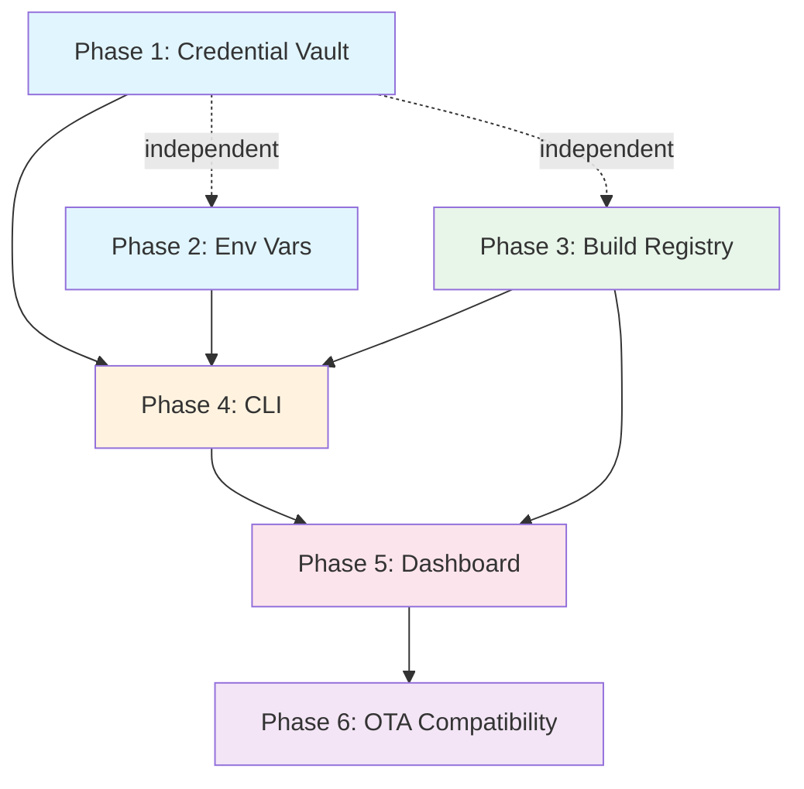

# 9. Implementation Plan

## Phased Delivery

Remote Cloud Build is intentionally out of scope for this plan. Builds run locally or in the user's own CI, and the server only manages credentials, metadata, and artifact storage.

### Phase 1: Credential Vault (End-to-End Encrypted)

**Goal**: Store and manage signing credentials with **client-side end-to-end encryption** — the server is zero-knowledge and never decrypts (see [02-credential-vault.md](./02-credential-vault.md), canonical).

**Deliverables**:

- **No server master key**: there is **no** `VAULT_KEYRING`/`VAULT_SECRET`, no server-side KEK/DEK derivation, and no server decryption path. The server stores only ciphertext + a wrapped DEK + `vault_version` + plaintext metadata.
- `@better-update/credentials-crypto` package (client-side): blob AEAD (XChaCha20-Poly1305), DEK wrap/unwrap, `age` vault-key wrapping to recipients, identity seal/open, on-disk identity format.
- D1 migration: per-type credential tables (`apple_distribution_certificates`, `apple_push_keys`, `asc_api_keys`, `apple_provisioning_profiles`, `google_service_account_keys`, `android_upload_keystores`, plus binding rows `ios_bundle_configurations` / `android_build_credentials`) carrying `wrapped_dek` + `vault_version` + plaintext metadata; new `user_encryption_keys`, `org_vault_key_wraps`, and `org_vaults` (authoritative `vault_version` per org) tables.
- R2 storage: **ciphertext** blobs in `BUILD_BUCKET` at `credentials/{org_id}/{credential_id}.enc` (server generates the key).
- Server-relay upload handler: accepts ciphertext + wrappedDek + vaultVersion + CLI-supplied metadata, validates shape/authz/size cap, writes R2 + D1 atomically (rollback R2 on D1 failure), **never sees plaintext**. No multipart file, no plaintext password.
- Recipient/vault repos + handlers: register/list/revoke encryption keys; fetch this recipient's wrapped vault key; accept wrap rows (authz = own-device self-link OR admin/owner, audited); atomic rotation (bulk DEK re-wrap + new wrap rows + new `vault_version`) guarded by compare-and-swap on `org_vaults.vault_version`.
- Ciphertext download/resolve: `GET /api/credentials/:id/download` and the build-resolve endpoint return ciphertext + wrappedDek + vaultVersion + metadata (Worker-relayed from R2); the CLI decrypts locally.
- API endpoints: `POST/GET/DELETE /api/credentials`, ciphertext `GET /api/credentials/:id/download`, plus `userEncryptionKeys` + `orgVault` groups (register key, get wrapped vault key, add wrap row, rotate).
- Effect HttpApiGroups: `CredentialsGroup`, `UserEncryptionKeysGroup`, `OrgVaultGroup`.
- Domain/wire schemas in `@better-update/api` (upload/download/resolve, encryption keys, vault wraps).
- Unit tests for the **client-side** crypto (wrap/unwrap, blob AEAD round-trip, identity seal/open, rotation re-wrap); server tests assert it stores opaque ciphertext and never decrypts.

**Acceptance criteria**:

- `credentials identity init` generates a device key, seals it locally with a passphrase, and registers the public recipient.
- First upload bootstraps the org vault key + offline recovery recipient; admin `access grant` / self-service `device link` add wrap rows; the server rejects an unauthorized wrap.
- Upload `.p12` / `.jks` / `.mobileprovision` / `.json`: CLI extracts metadata, encrypts locally, and uploads ciphertext via the server-relay handler; R2 + D1 written atomically; the server stores no plaintext (provisioning profiles stored plaintext as before — not secret).
- `GET /api/credentials/:id/download` returns **ciphertext** (never plaintext); the CLI unwraps the DEK, decrypts, and re-verifies metadata.
- Delete removes both the R2 ciphertext and the D1 row.
- List returns plaintext metadata only, never ciphertext or wrapped DEKs.
- Revoke **always rotates**: an atomic rotation re-wraps every DEK under a new `vault_version`, drops the revoked wrap, and is rejected unless it covers every credential at the old version (CAS-guarded).

### Phase 2: Environment Variables

**Goal**: Manage per-project per-environment variables with visibility tiers.

**Deliverables**:

- D1 migration: `env_vars` table
- Env var values stored **plaintext** in D1 (no encryption — see migration 0038 / [03-environment-variables](./03-environment-variables.md)); visibility tiers control dashboard masking, not encryption. No R2 for env vars.
- API endpoints: `POST/GET/PATCH/DELETE /api/env-vars`, `POST /api/env-vars/import`, `GET /api/env-vars/export`
- Effect HttpApiGroup: `EnvVarsGroup`
- Domain schemas: `EnvVar`, `CreateEnvVarBody`, `UpdateEnvVarBody`
- Validation rules (key format, reserved keys, limits)

**Acceptance criteria**:

- CRUD for all three visibility tiers
- Values stored plaintext in D1 (R2 not used for env vars); visibility tiers drive dashboard masking only
- Bulk import from `.env` format
- Export endpoint returns all values (API key auth only — session auth rejected)
- Unique constraint on (project_id, environment, key) enforced

### Phase 3: Build Registry & Artifact Upload

**Goal**: Accept build artifacts and store them via presigned URL upload.

**Deliverables**:

- Wrangler config: `BUILD_BUCKET` private R2 binding (separate from `ASSETS_BUCKET`)
- D1 migration: `builds`, `build_artifacts` tables + indexes
- Wrangler config: `BUILD_RESERVATIONS` KV namespace for build upload reservations (3-hour TTL)
- Presigned URL generation for R2 direct upload to `staging/` prefix (S3-compatible API via `@aws-sdk/s3-request-presigner`, requires R2 API credentials)
- API endpoints: `POST /api/builds` (reserve in KV + presigned staging URL, no D1 row), `POST /api/builds/:id/complete` (verify staging object + copy to `artifacts/` + insert D1 rows atomically + delete staging + delete KV), `GET /api/builds`, `GET /api/builds/:id`, `DELETE /api/builds/:id`
- API endpoint: `GET /api/builds/:id/artifact` (presigned R2 download URL redirect)
- API endpoint: `GET /api/builds/:id/install` (iOS itms-services plist)
- Signed install token generation
- Artifact retention Cron handler (also cleans orphaned uploads never finalized)
- Effect HttpApiGroup: `BuildsGroup`
- Domain schemas: `Build`, `BuildArtifact`, `CreateBuildBody`

**Acceptance criteria**:

- Reserve build (KV, 3-hour TTL) → receive presigned staging URL (2-hour expiry) → upload `.ipa` directly to R2 staging → finalize (copy to artifacts/, insert D1 atomically) → build record complete
- Same flow for `.aab` and `.apk`
- Download via presigned URL redirect
- Install ad-hoc `.ipa` on iOS device via itms-services link (signed HMAC token, 1-hour expiry)
- List builds filtered by project, platform, profile, runtimeVersion
- Delete → R2 object and D1 records removed
- Orphaned R2 objects (never finalized — no matching D1 row) cleaned up by Cron
- Build metadata is client-supplied (server does not parse binary artifacts)

### Phase 4: CLI — Build Orchestration

**Goal**: CLI that downloads + decrypts credentials locally, runs local build, uploads artifact.

**Deliverables**:

- RBAC permissions: `build:*`, `credential:*`, `vault:grant`/`vault:revoke`, `envVar:*` scopes added to auth middleware
- `better-update` npm package with CLI entry point
- `IdentityStore` + OS-keychain vault-key cache (`@better-update/credentials-crypto`); encrypt-on-upload + metadata extraction; decrypt-on-build (see [02-credential-vault.md](./02-credential-vault.md))
- Build profile schema in `app.json` → `expo.extra.betterUpdate.profiles`
- `better-update build`: resolve creds (download ciphertext + decrypt locally) → pull env → prebuild → xcodebuild/gradlew → presigned artifact upload
- Interactive credential provisioning on first build (sets up the encryption identity, then select from disk for iOS, select or generate for Android — all encrypted locally before upload)
- Android keystore generation
- `better-update credentials` subcommands: `identity` (init / list / rotate / passphrase change), `access` (grant / revoke / rotate / recover / recovery rotate), `device link`, `upload` (encrypts locally), `list`, `delete`, `generate-keystore`, `lock`
- Client-side Apple ASC + Google Play calls (decrypt the store key locally, call the provider directly; no server-side sync)
- `better-update env` subcommands (set, list, delete, import, export, pull)
- `better-update init` (link project)
- `better-update login` (OAuth + API key auth); CI also reads `BETTER_UPDATE_IDENTITY` for non-interactive decryption
- iOS code signing automation (ephemeral keychain, profile install)
- Android signing via Gradle init script

**Acceptance criteria**:

- `better-update credentials identity init` → device key generated, sealed locally, public recipient registered
- First `better-update build --platform ios` → sets up identity → prompts for creds → encrypts locally → uploads → builds → uploads artifact
- Subsequent builds → download existing ciphertext → decrypt locally → build → upload
- `better-update build --platform android` → keystore prompt/generate (encrypted locally) → builds → uploads
- `better-update env import .env.production` → stored on server
- `better-update credentials list` → shows all with expiry info
- `better-update credentials access grant <user>` → re-wraps the vault key to a new recipient (admin-gated)

### Phase 5: Dashboard

**Goal**: Build + env var management UI, plus **read-only** credential views.

**Deliverables**:

- Build list page with filters, build detail page with download/install/QR
- Upload build from dashboard (drag & drop with metadata form: user must provide `platform`, `profile`, `distribution`, `runtimeVersion`, `appVersion`, `buildNumber`, `bundleId` — the dashboard cannot extract these from the binary in v1)
- Credential pages are **read-only** (no upload, no delete, no edit/bind — those are CLI-only because the dashboard never holds key material): list + per-credential metadata with expiry warnings, plus an **Access** view per org (recipients — users / devices / CI / the offline recovery key — with fingerprints, kind, last-used, and pending-access members). Mutations show a hint to use `better-update credentials …` (see [02-credential-vault.md](./02-credential-vault.md)).
- Environment variables page: per-environment CRUD, bulk import, visibility
- `queryOptions` and mutation factories in `@better-update/api-client`

**Acceptance criteria**:

- Full CRUD for builds and env vars from dashboard; credentials are read-only (metadata + Access view, no upload/delete)
- Download artifact, scan QR to install on device
- Credential expiry warnings visible; Access view lists recipients + pending-access members

### Phase 6: OTA Compatibility Tracking

**Goal**: Link builds to OTA update channels via runtimeVersion.

**Deliverables**:

- Build detail: "Compatible channels" section
- Channel detail: "Compatible builds" section
- Builds × Channels matrix view
- Warning for runtimeVersion mismatches

**Acceptance criteria**:

- Build detail shows compatible channels
- Channel detail shows compatible builds
- Stale build warning when appropriate

## Dependency Graph

**Parallel tracks**: P1, P2, P3 are independent — develop in parallel.

**Critical path for CLI**: P1 + P2 + P3 → P4.

## Future Phases

| Phase                   | Description                                                      |
| ----------------------- | ---------------------------------------------------------------- |
| **Apple Developer API** | Create certs/profiles programmatically via App Store Connect API |
