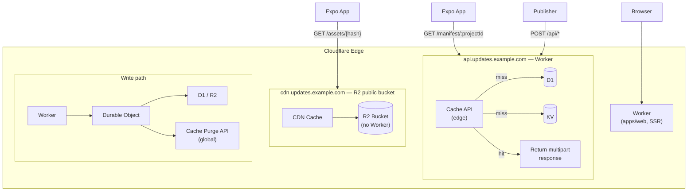
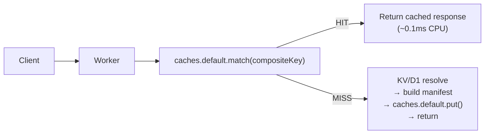
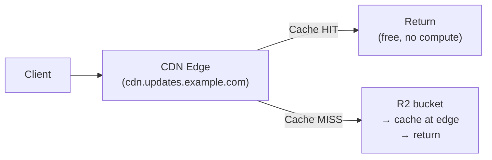
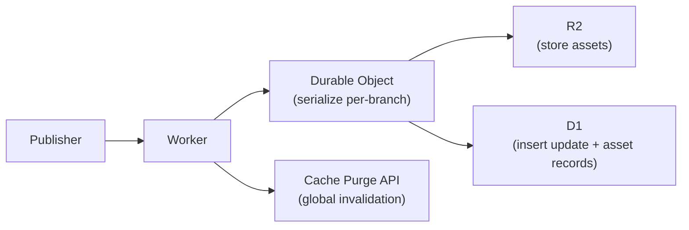
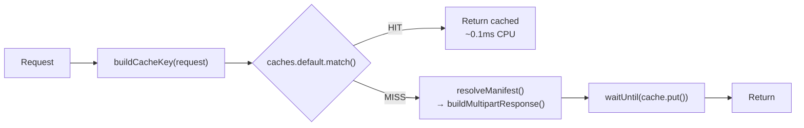

# 1. System Architecture

## Overview

The system splits into two traffic patterns with different cost profiles:

- **Manifest requests** — must pass through a Worker (header-based routing), optimized with Cache API
- **Asset requests** — served directly from R2 public bucket, bypassing Workers entirely (zero compute cost)

## Request Flows

**Manifest request (read, hot path — Worker + Cache API):**

**Asset request (read, hot path — R2 public bucket, NO Worker):**

**Publish request (write, cold path):**

---

# 2. Cost Optimization Strategy

## The Problem

Cloudflare Workers are **always invoked before CDN cache** — there is no way to place CDN cache in front of a Worker. Every request to a Worker domain counts as a billable invocation, even if the response could be served from cache.

For an update server with high read volume (every app launch = manifest check), this means every manifest request costs a Worker invocation.

## The Solution: Split Read Paths

| Path                       | Mechanism              | Worker Invocation | Cost per 1M requests           |
| -------------------------- | ---------------------- | ----------------- | ------------------------------ |
| **Manifest** (`/manifest`) | Worker + Cache API     | Yes (unavoidable) | $0.30 + ~$0 CPU                |
| **Assets** (`/assets/*`)   | R2 public bucket + CDN | **No**            | $0 (CDN hit) / $0.36 (R2 read) |
| **Publish** (`/api/*`)     | Worker + DO            | Yes (infrequent)  | Negligible                     |

## Why Workers Can't Be Bypassed for Manifests

The expo-updates client sends routing information via **request headers** (`expo-platform`, `expo-runtime-version`, `expo-channel-name`), not URL path segments. The `updates.url` in `app.json` is a single fixed URL.

This means:

- CDN cache cannot vary by custom headers (only Enterprise plan supports custom cache keys with headers)
- R2 public bucket cannot route by headers (serves files by URL path only)
- Some compute is needed to translate headers → correct manifest

## Why Workers CAN Be Bypassed for Assets

Assets are fetched by URL path (`/assets/{hash}`). No header-based routing needed. A content-addressed URL maps 1:1 to an R2 object. R2 public bucket with CDN caching handles this perfectly.

## Cost Model at Scale

Assumptions: 1M daily active devices, each checking for updates once per launch.

| Component                          | Monthly Volume | Cost                        |
| ---------------------------------- | -------------- | --------------------------- |
| Manifest requests (Worker)         | 30M            | $6 (after 10M free)         |
| Manifest CPU time (cache hits)     | ~3M CPU-ms     | Free (within 30M free tier) |
| Asset requests (R2 public CDN)     | 60M            | $0 (CDN hits)               |
| Asset R2 reads (cache misses)      | ~2M            | $0.72                       |
| D1 queries (manifest cache misses) | ~5M            | $3.75                       |
| KV reads (channel resolution)      | ~5M            | Free (within free tier)     |
| R2 storage (assets)                | ~10 GB         | $0.15                       |
| **Total**                          |                | **~$11/month**              |

Compare: Worker-only architecture (no R2 public bucket) would add $18/month for asset request invocations.

## Cache API: Minimizing CPU Cost

Even though Workers are always invoked for manifests, the Cache API makes cache hits nearly free:

Workers Standard pricing bills CPU time at $0.02/million CPU-ms. At 0.1ms per cache hit:

- 100M cache hits = 10M CPU-ms = **free** (within 30M free tier)

## Cache API vs KV for Manifest Caching

| Aspect            | Cache API (`caches.default`)        | KV                                  |
| ----------------- | ----------------------------------- | ----------------------------------- |
| Read latency      | ~0.5ms (local datacenter)           | ~0.5ms (edge cached) / ~10ms (cold) |
| Write propagation | Local datacenter only               | ~60s global eventual consistency    |
| Tiered caching    | No                                  | No (KV has its own replication)     |
| Cache eviction    | Automatic (LRU, Cloudflare managed) | Manual (TTL-based)                  |
| Cost              | Free (part of Worker)               | $0.50/million reads                 |
| Purge             | `cache.delete()` local only         | `KV.delete()` propagates globally   |
| Global purge      | Cloudflare Purge API                | Overwrite with new value            |

**Decision: Use Cache API as primary manifest cache, KV as fallback for channel→branch mappings.**

Cache API is faster and free but local-only. For manifests that change infrequently (only on publish), the "cold start" cost of populating cache at each datacenter is negligible — each PoP resolves from D1 once, then serves from local cache until purge.

---

# 3. Cloudflare Service Mapping

| Service            | Role                      | Why This Service                                                                    |
| ------------------ | ------------------------- | ----------------------------------------------------------------------------------- |
| **Worker**         | HTTP entry point, routing | Runs at edge, handles protocol logic, generates manifests                           |
| **D1**             | Metadata storage          | Relational queries: channel→branch→update resolution, filtering, ordering           |
| **R2**             | Asset blob storage        | Zero egress cost, immutable content-addressed assets, CDN cache integration         |
| **KV**             | Read cache                | Sub-millisecond edge reads for channel mappings and cached manifests                |
| **Durable Object** | Publish coordination      | Serialized writes per branch — prevents race conditions during concurrent publishes |

## What each service does NOT do

| Service | Explicitly Not Used For                                                    |
| ------- | -------------------------------------------------------------------------- |
| D1      | Storing asset blobs (2 MB row limit, not designed for binary data)         |
| KV      | Source of truth for metadata (eventually consistent, no transactions)      |
| R2      | Querying or filtering updates (no query capability)                        |
| DO      | Serving manifest reads (single-instance bottleneck, unnecessary for reads) |
