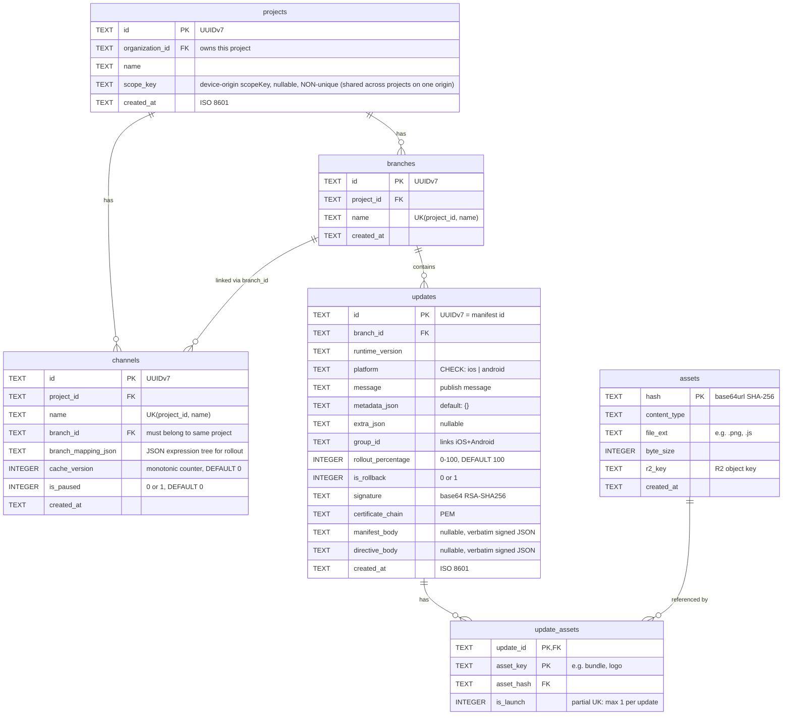

# 4. Data Model (D1)

## Schema

## Indexes

| Index                         | Columns                                                            | Purpose                                     |
| ----------------------------- | ------------------------------------------------------------------ | ------------------------------------------- |
| `idx_projects_scope_key`      | `scope_key` (non-unique, partial `WHERE scope_key IS NOT NULL`)    | Lookup project by device-origin scopeKey    |
| `idx_branches_project_name`   | `(project_id, name)` UNIQUE                                        | Lookup branch by project + name             |
| `idx_channels_project_name`   | `(project_id, name)` UNIQUE                                        | Lookup channel by project + name            |
| `idx_updates_resolution`      | `(branch_id, platform, runtime_version, created_at DESC, id DESC)` | **Critical** — manifest resolution query    |
| `idx_updates_group`           | `group_id`                                                         | Dashboard: find paired iOS/Android updates  |
| `idx_update_assets_update`    | `update_id`                                                        | Join assets for a given update              |
| `idx_update_assets_launch`    | `update_id` WHERE `is_launch = 1` UNIQUE                           | Enforce exactly one launch asset per update |
| `idx_channels_branch_project` | `(branch_id, project_id)`                                          | Enforce channel→branch same-project         |
| `idx_projects_org`            | `organization_id`                                                  | List projects by organization               |

## Key Design Decisions

**UUIDv7 for IDs:** Monotonically increasing, sortable by time, globally unique. Suitable for distributed generation without coordination.

**Content-addressed assets:** The `assets` table is keyed by SHA-256 hash. Identical assets across updates are stored once in R2. The `update_assets` junction table maps updates to their assets.

**`is_rollback` flag:** Instead of a separate directives table, rollback directives are modeled as updates with `is_rollback = 1`. This simplifies the resolution query — the latest entry on a branch determines the response type (manifest vs directive). Following the EAS CLI model, the publisher pre-signs both manifests and directives before uploading — the server stores and forwards signatures without signing anything itself.

**`group_id`:** Links iOS and Android updates published together. Used by the dashboard to display update groups.

**`organization_id` on projects:** All projects belong to exactly one organization. Organization-scoped access control ensures management API requests can only access projects within the caller's organization (see [spec 21](./21-authentication.md)).

**`scope_key` on projects:** The expo-updates v1 **device-origin scopeKey** — `normalizedURLOrigin(updateUrl)` — that each installed app uses to partition its local protocol-metadata store (`expo-server-defined-headers`, and `expo-manifest-filters` in the selection-policy work). The server reproduces the same string via `src/domain/scope-key.ts` so per-(project, scopeKey) state and the manifest cache key line up with what the device computes. This is **not** an EAS-style per-project `@owner/slug` identity: because it is an _origin_, it is **intentionally shared** across every project served from the same `PUBLIC_API_URL`, so the column is **non-unique**. The value is nullable; for NULL (legacy) rows the manifest handler falls back to `normalizedURLOrigin(PUBLIC_API_URL)` at request time, so an explicit value is only needed when a project's update origin differs from `PUBLIC_API_URL` (e.g. a custom domain). Tenant isolation comes from the compound `(project_id, scope_key)` key on `project_protocol_metadata` and from including `scope_key` in the manifest cache key — never from uniqueness on this column.

**`cache_version` on channels:** A monotonic integer counter bumped atomically with any state change that affects manifest responses (publish, relink, rollout change, pause/resume, update deletion). Included in the Cache API cache key to ensure stale entries are never matched — cache purge becomes a cleanup optimization, not a correctness requirement. See [spec 10](./10-caching.md).

**`is_paused` on channels:** When set to `1`, the manifest endpoint returns `204 No Content` for all requests to this channel. See [spec 15](./15-management-extensions.md).

**`rollout_percentage` on updates:** Controls per-update gradual rollouts. `100` = fully available (default). `1`-`99` = partial rollout. `0` = reverted (skipped in resolution — all devices receive the previous update). See [spec 17](./17-per-update-rollouts.md).

**No `status` column:** All updates are active. Rollbacks are modeled by publishing a new entry (either a new update or a rollback directive). The latest entry always wins.

**`branch_mapping_json` on channels:** Encodes gradual rollout logic as a JSON expression tree (matching EAS Update's `branchMapping` format). When set, overrides `branch_id` for manifest resolution. When `NULL`, the simple `branch_id` mapping applies.

**`signature` + `certificate_chain` on updates:** Stored inline rather than in a separate table. Both manifest signatures and directive signatures are provided by the publisher at publish time and served as-is.

**`manifest_body` + `directive_body` on updates:** When code signing is active, the publisher constructs and signs the full manifest/directive JSON before uploading. The server stores this verbatim in `manifest_body` (for normal updates) or `directive_body` (for rollback directives) and serves it as-is to preserve the publisher's signature. When signing is not active, these columns are `NULL` and the server constructs the manifest at serve time from relational data.

**`created_at` = served commitTime (clock-skew invariant):** The device selects the newest update by the **served body's commitTime** — a normal manifest's `createdAt` or a rollback directive's `parameters.commitTime` — switching only when it is _strictly greater_ than the launched update's. Precomputed bodies (signed manifests + all directives) are served verbatim, so their commitTime is the **publishing machine's** clock, not the server's. To keep the server's `ORDER BY created_at DESC` resolution in exact agreement with the device, the publish path stamps `created_at = the served commitTime` for every precomputed row (`domain/signed-update-recency.ts` → `publishCreatedAt`); unsigned normal updates render their `createdAt` _from_ this DB value, so they agree by construction. With this invariant, **server-newest == device-newest for every row**, regardless of which machine's clock stamped it — closing the cross-machine clock-skew gap where the server would serve a row every device rejects as older (`UPDATE_REJECTED_BY_SELECTION_POLICY`). A publish-time guard (`application/clock-skew-guard.ts`) additionally **rejects** a precomputed publish (incl. republish) whose commitTime is not strictly newer than the row the tuple currently serves, turning a silently-never-applied update into a clear `409`. Because the invariant aligns the two orderings, this guard is total for the precomputed path and cannot false-reject. (Republished signed updates carry a CLI-re-stamped replacement manifest; unsigned republishes get a fresh server-clock `created_at`.)

**`PRIMARY KEY (update_id, asset_key)` on update_assets:** Ensures each logical asset key (e.g., "bundle", "logo") appears at most once per update. The partial unique index `idx_update_assets_launch` enforces exactly one launch asset per update.

Note: This index enforces **at most** one launch asset per update. The publish endpoint must additionally validate **exactly one** launch asset for normal updates, and **zero** assets for rollback directives.

## Indexes Explained

**`idx_updates_resolution`** — the critical index for manifest serving. Resolves "latest update for branch X, platform Y, runtime version Z" in a single indexed query. `ORDER BY created_at DESC, id DESC` orders by the served commitTime (see the `created_at` = served-commitTime invariant above), with `id DESC` only as a deterministic (but non-temporal) tiebreaker — update ids are random UUIDv4, NOT monotonic, so `id DESC` does not encode recency. Because `created_at` equals the served commitTime for every row, this ordering matches the device's strict-greater selection exactly. The only residual tie is two rows on one tuple sharing an identical commitTime: a precomputed publish that ties (or loses to) the current latest is rejected by the publish-time clock-skew guard, and unsigned single inserts run under the publish Durable Object's single-writer lock (they still stamp raw wall-clock ms — two unsigned publishes within the same ms on one tuple could in theory tie; enforcing `max(now, latest+1ms)` there is a tracked hardening). This single query handles the entire channel→branch→update resolution after the channel lookup.
