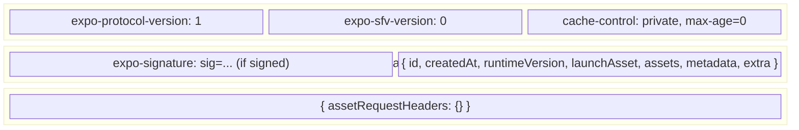

# 6. Manifest Serving (Hot Path)

This is the most latency-sensitive path. Every app launch triggers a manifest check.

## Request Processing

`GET /manifest/{projectId}` with the following headers:

| Header                           | Example / Value                                                        | Required                            |
| -------------------------------- | ---------------------------------------------------------------------- | ----------------------------------- |
| `expo-protocol-version`          | `1`                                                                    | Yes                                 |
| `expo-platform`                  | `ios` or `android`                                                     | Yes                                 |
| `expo-runtime-version`           | `1.0.0`                                                                | Yes                                 |
| `expo-channel-name`              | `production`                                                           | Optional (defaults to `production`) |
| `accept`                         | `multipart/mixed, application/expo+json;q=0.9, application/json;q=0.8` | Yes                                 |
| `expo-expect-signature`          | `sig, keyid="main", alg="rsa-v1_5-sha256"`                             | Optional                            |
| `eas-client-id`                  | `<device-uuid>`                                                        | Optional (rollouts)                 |
| `expo-extra-params`              | SFV dictionary                                                         | Optional                            |
| (persisted from prior responses) | `expo-server-defined-headers` values                                   | Conditional                         |

## Resolution Algorithm

```mermaid
flowchart TD
    Start["GET /manifest/{projectId}"] --> Parse["1 · Parse &amp; validate headers<br/>projectId · platform · runtimeVersion · channel<br/>protocol-version=1 · Accept negotiation"]
    Parse --> Resolve["2 · Resolve channel → branch"]

    Resolve --> KV{"KV hit?"}
    KV -->|Yes| Chan["Channel record"]
    KV -->|No| D1C["D1 SELECT channels"] --> KVPut["KV.put(...)"] --> Chan

    Chan --> Paused{"is_paused?"}
    Paused -->|Yes| R204P["204 No Content<br/>+ common headers"]
    Paused -->|No| Rollout{"branch_mapping_json<br/>set?"}
    Rollout -->|Yes| Eval["3 · Evaluate expression tree<br/>with EAS-Client-ID<br/>→ resolvedBranchId"]
    Rollout -->|No| Direct["Use channel.branch_id"]

    Eval --> Query4["4 · D1: latest 2 updates<br/>ORDER BY created_at DESC, id DESC<br/>LIMIT 2"]
    Direct --> Query4

    Query4 --> UpdateRollout{"Latest update:<br/>rollout_percentage = 100?"}
    UpdateRollout -->|Yes| SetResolved1["resolvedUpdateId = latest.id"]
    UpdateRollout -->|No| EvalUpdate["5 · Evaluate hash_lt<br/>(EAS-Client-ID,<br/>rollout_percentage / 100)"]

    EvalUpdate --> InRollout{"Device in<br/>rollout?"}
    InRollout -->|Yes| SetResolved1
    InRollout -->|No| UsePrev{"Previous update<br/>qualifies?"}
    UsePrev -->|Yes| SetResolved2["resolvedUpdateId = previous.id"]
    UsePrev -->|No| R204["204 No Content<br/>+ common headers"]

    SetResolved1 --> CacheKey["6 · Build composite cache key<br/>/_cache/v{cacheVersion}/manifest/<br/>{projectId}/{channel}/{platform}/<br/>{runtimeVersion}/{resolvedBranchId}/<br/>{resolvedUpdateId}"]
    SetResolved2 --> CacheKey

    CacheKey --> CacheHit{"7 · Cache API<br/>match?"}
    CacheHit -->|HIT| Return1["Return cached response<br/>(~0.1ms CPU)"]
    CacheHit -->|MISS| Result{"8 · is_rollback?"}

    Result -->|is_rollback = 1| Directive["Build rollBackToEmbedded<br/>directive (from directive_body<br/>or constructed)"]
    Result -->|is_rollback = 0| Query9["9 · D1: query update assets"]

    Query9 --> AssetCheck{"All referenced<br/>assets exist in R2?"}
    AssetCheck -->|No| R500["500 Internal Server Error<br/>(log missing asset hashes)"]
    AssetCheck -->|Yes| SignedCheck2{"manifest_body<br/>present?"}

    SignedCheck2 -->|Yes| BodyCheck{"manifest_body<br/>valid JSON?"}
    BodyCheck -->|No| R500b["500 Internal Server Error<br/>(log malformed body)"]
    BodyCheck -->|Yes| Build10

    SignedCheck2 -->|No| Build10

    Directive --> Accept{"Accept includes<br/>multipart/mixed?"}
    Accept -->|No| R406["406 Not Acceptable"]
    Accept -->|Yes| Build10

    Build10["10 · Build manifest response<br/>(from manifest_body if signed,<br/>or constructed from relational data)"]
    Build10 --> Cache11["11 · ctx.waitUntil(<br/>caches.default.put())"]
    Cache11 --> Return2["Return response"]
```



## Cache Key Composition

The composite cache key is built **after** all routing decisions (channel resolution, rollout evaluation, update resolution) so the key fully determines the response:

`/_cache/v{cacheVersion}/manifest/{projectId}/{channel}/{platform}/{runtimeVersion}[/{resolvedBranchId}][/{resolvedUpdateId}]`

| Segment            | Source                           | Purpose                                   |
| ------------------ | -------------------------------- | ----------------------------------------- |
| `cacheVersion`     | Channel/branch metadata          | Bumped on publish, relink, rollout change |
| `projectId`        | URL path `/manifest/{projectId}` | Isolate projects                          |
| `channel`          | Header `expo-channel-name`       | Isolate channels                          |
| `platform`         | Header `expo-platform`           | ios vs android                            |
| `runtimeVersion`   | Header `expo-runtime-version`    | Version targeting                         |
| `resolvedBranchId` | Rollout evaluation (optional)    | Differentiate branch rollout variants     |
| `resolvedUpdateId` | Update rollout evaluation (opt.) | Differentiate per-update rollout variants |

The `cacheVersion` is a monotonic counter stored alongside the channel record. It is incremented atomically with every publish, channel relink, rollout change, pause/resume, or update deletion that affects this channel's manifest. Including it in the cache key ensures stale entries are never matched — cache purge becomes a cleanup optimization, not a correctness requirement.

Rollout evaluations and update resolution happen **before** the cache lookup so the cache key is fully determined. Both are cheap operations (~0.1ms each).

**Note on resolution order:** Rollout evaluations and update resolution happen before the cache lookup. This is necessary because the resolved branch ID and update ID are part of the cache key. The D1 query (step 4) fetches at most 2 rows from an indexed table (~2-3ms). Subsequent requests for the same device bucket hit cache directly.

## Common Response Headers (sent on ALL responses including 204)

| Header                        | Value                | Condition     |
| ----------------------------- | -------------------- | ------------- |
| `expo-protocol-version`       | `1`                  | Always        |
| `expo-sfv-version`            | `0`                  | Always        |
| `cache-control`               | `private, max-age=0` | Always        |
| `expo-manifest-filters`       | SFV dictionary       | If configured |
| `expo-server-defined-headers` | SFV dictionary       | If configured |

The protocol requires these headers even on `204 No Content` responses. The client MUST process them regardless of status code.

## Accept Negotiation

The Expo Updates v1 protocol supports both multipart and JSON response formats. The server must respect the client's `Accept` header:

| Client `Accept` includes     | Response format       | When used                   |
| ---------------------------- | --------------------- | --------------------------- |
| `multipart/mixed`            | Multipart (preferred) | Modern expo-updates clients |
| `application/expo+json` only | JSON                  | Legacy clients              |
| `application/json` only      | JSON                  | Fallback                    |
| None of the above            | `406 Not Acceptable`  | Unsupported client          |

**Directive responses require `multipart/mixed`.** If the resolved update is a rollback directive (`is_rollback = 1`) and the client does not accept `multipart/mixed`, return `406 Not Acceptable`. Directives cannot be represented in the JSON-only format.

**`expo-expect-signature` handling:**

| Scenario                                                                           | Behavior                                                                                                                      |
| ---------------------------------------------------------------------------------- | ----------------------------------------------------------------------------------------------------------------------------- |
| Client sends `expo-expect-signature`, update has `signature` + `certificate_chain` | Include `expo-signature` part header + `certificate_chain` multipart part                                                     |
| Client sends `expo-expect-signature`, update has no signature                      | Return the manifest without signature. The client will reject it — this is expected. The server does not generate signatures. |
| Client does not send `expo-expect-signature`                                       | Omit signature headers and certificate chain part                                                                             |

## Response Format

**Multipart response structure** (`content-type: multipart/mixed`):



Note: `cache-control: private, max-age=0` is required by the protocol — manifests must not be cached by intermediaries or the client. The Worker's Cache API uses a **separate internal TTL** (set via `cache.put()` with custom `Cache-Control` on the stored response) that does not affect the client-facing header. Active purge on publish invalidates the internal cache.

**JSON response structure** (`content-type: application/expo+json` or `application/json`):

Used when the client does not accept `multipart/mixed`. Only supported for manifest responses (not directives):

```json
{
  "id": "<update-id>",
  "createdAt": "<ISO 8601>",
  "runtimeVersion": "<version>",
  "launchAsset": { "hash": "...", "key": "...", "url": "...", "contentType": "..." },
  "assets": [{ "hash": "...", "key": "...", "url": "...", "contentType": "..." }],
  "metadata": {},
  "extra": {}
}
```

When code signing is active, the `expo-signature` response header is set on the JSON response (not as a multipart part header).

## Error Handling

| Condition                                            | Response                          | Action                                                |
| ---------------------------------------------------- | --------------------------------- | ----------------------------------------------------- |
| Missing/invalid `expo-protocol-version`              | `400 Bad Request`                 | —                                                     |
| Missing `expo-platform` or `expo-runtime-version`    | `400 Bad Request`                 | —                                                     |
| Project not found                                    | `404 Not Found`                   | —                                                     |
| Channel not found                                    | `404 Not Found`                   | —                                                     |
| No update available                                  | `204 No Content` + common headers | —                                                     |
| Channel paused                                       | `204 No Content` + common headers | —                                                     |
| Directive + client does not accept `multipart/mixed` | `406 Not Acceptable`              | —                                                     |
| Unsupported `Accept` header (no recognized format)   | `406 Not Acceptable`              | —                                                     |
| Stored `manifest_body` is malformed JSON             | `500 Internal Server Error`       | Log error with update ID for investigation            |
| Referenced asset missing from R2                     | `500 Internal Server Error`       | Log missing asset hash; do not serve partial manifest |
| D1 query failure                                     | `500 Internal Server Error`       | Log error; do not cache error responses               |

Error responses (`4xx`, `5xx`) must still include the common protocol headers (`expo-protocol-version`, `expo-sfv-version`). Error responses are never cached in the Cache API.

## Performance Target

| Step                     | Target Latency |
| ------------------------ | -------------- |
| Cache API hit (manifest) | < 1 ms         |
| KV cache hit (channel)   | < 1 ms         |
| D1 indexed query         | 2-5 ms         |
| Total (Cache API hit)    | < 1 ms         |
| Total (full cache miss)  | < 15 ms        |
