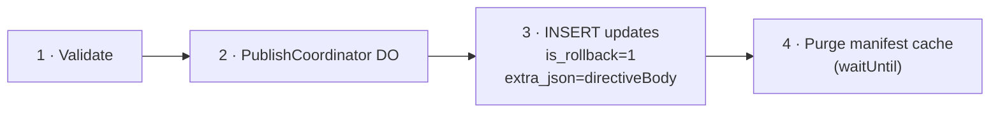

# 11. Rollback Support

## Rollback to Previous Update (Republish)

Re-publish a prior update as the newest entry on a branch. Following the EAS CLI model, the publisher constructs the full manifest (pointing to the same assets as the target update), optionally signs it, then uploads:

`POST /api/updates` — same endpoint as normal publish, with the manifest pointing to the **same assets** as the target update:

| Field              | Value                                      |
| ------------------ | ------------------------------------------ |
| `branch`           | Target branch (e.g., `"production"`)       |
| `manifestBody`     | Full manifest JSON (same assets as target) |
| `signature`        | Optional — pre-signed by publisher         |
| `certificateChain` | Optional                                   |
| `assets`           | Same asset hashes as the target update     |

Since assets are content-addressed and deduplicated, this creates no new R2 objects — only a new `updates` row pointing to the same assets.

## Rollback to Embedded (Directive)

The publisher constructs and signs the directive locally, then submits it as a regular update entry with `is_rollback = 1`. This follows the EAS CLI pattern where `eas update:roll-back-to-embedded` constructs and signs the directive client-side before uploading.

`POST /api/updates` with `isRollback: true`:

| Field              | Value                                                             |
| ------------------ | ----------------------------------------------------------------- |
| `isRollback`       | `true`                                                            |
| `directiveBody`    | `{"type":"rollBackToEmbedded","parameters":{"commitTime":"..."}}` |
| `signature`        | Optional — pre-signed directive                                   |
| `certificateChain` | Optional                                                          |
| `assets`           | `[]` (no assets for rollback directives)                          |

Processing:

When the manifest endpoint resolves the latest update and finds `is_rollback = 1`, it responds with the stored `directive_body` (served verbatim to preserve the publisher's signature). If `directive_body` is `NULL` (unsigned mode), the server constructs the directive from the update's metadata.

### Code signing and rollback directives

A device with code signing configured sends `expo-expect-signature` and **hard-rejects** any manifest _or_ directive that arrives without a valid `expo-signature` (`allowUnsignedManifests` defaults to `false`). The server therefore treats an **unsigned** rollback exactly like an unsigned manifest: it is dropped from selection for a signing client, and the endpoint returns **`204 No Content`** so the device keeps running its current/embedded update rather than aborting its update check.

Consequence: a code-signing project **must publish a _signed_ rollback directive** for the rollback to take effect on signing clients. The CLI does this two ways:

- **Auto-sign (recommended):** `bu update rollback --branch <b> --private-key-path <key.pem>` reads `updates.codeSigningCertificate` / `updates.codeSigningMetadata` from `app.json`, then renders and `rsa-v1_5-sha256`-signs the `rollBackToEmbedded` directive in-process — parity with `bu update publish --private-key-path`. The signature covers the exact directive body bytes the server stores and serves verbatim, and the same signed triple is reused across every rolled-back platform (the directive body only carries `commitTime`, so it is platform-independent).
- **Pre-signed files (escape hatch):** `bu update rollback --directive-body-file <file> --signature-file <file> --certificate-chain-file <file>` uploads a directive you signed externally. Mutually exclusive with `--private-key-path`.

An **unsigned** rollback issued against a signing-enabled app is gracefully skipped (204), not delivered.

> Scope: auto-sign signs the **bare** directive body — which is what **development / self-signed** certificates require (those generated by `expo-updates codesigning:generate` carry no `expoProjectInformation` extension, so the device skips the project-info cross-check). EAS-issued **project-scoped** certificates additionally require the directive to carry `extra.signingInfo` matching the cert's `expoProjectInformation`; better-update embeds no project-binding metadata on either manifests or directives, so project-scoped certs are out of scope codebase-wide — use the file escape-hatch with an externally-built `extra.signingInfo` directive if you must use one.
