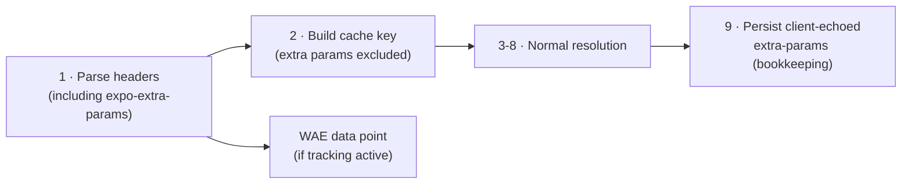
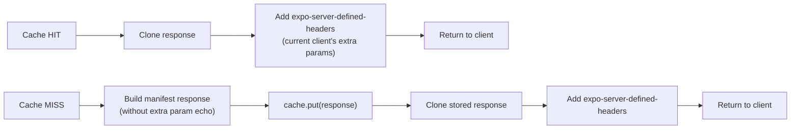

# 20. Extra Params (Custom Targeting)

## Overview

Clients can set custom key-value parameters via `Updates.setExtraParamAsync(key, value)`. These are sent as the `Expo-Extra-Params` header on every manifest request. The server parses, logs, and echoes them back — but does **not** use them for update resolution in the initial implementation.

This enables client-side segmentation (analytics, A/B cohort tracking) without fragmenting the manifest cache.

## Header Format

`Expo-Extra-Params` is a Structured Field Values (RFC 8941) dictionary:

```
expo-extra-params: user-cohort="beta", feature-flag="dark-mode"
```

| SFV type         | Key constraints          | Value constraints          |
| ---------------- | ------------------------ | -------------------------- |
| Dictionary       | Lowercase ASCII, hyphens | String, Integer, Boolean   |
| Max keys         | 16                       | —                          |
| Max value length | —                        | 256 bytes per string value |

Parsing uses the same SFV library as other structured headers (`expo-manifest-filters`, `expo-server-defined-headers`).

If the header is malformed, the server ignores it and continues manifest resolution without extra params. No error response — a bad extra param must not block updates.

## Processing

Extra params are parsed in Step 1 of the manifest resolution algorithm (spec 04) alongside other request headers. They flow through the pipeline as metadata but do not affect resolution:



### Step 1 — Parse

Parse `expo-extra-params` as an SFV dictionary. Store the parsed map on the request context for downstream use. If absent or malformed, use an empty map.

### Step 9 — Persist (bookkeeping only)

`better-update` does **NOT** emit an `expo-server-defined-headers` response header. Echoing the client's own `expo-extra-params` back would be inert: the `expo-updates` client sources extra-params from its **own** persisted store (`FileDownloader` keeps `getServerDefinedHeaders` and `getExtraParams` as separate stores), never from a server echo — and a `:base64:` byte-sequence value falls outside the Expo SFV-0 subset, so emitting it would be a spec-malformed (if client-tolerated) header. Absent the header, the device keeps its existing stored map, which is the correct safe default.

The server instead persists the client-echoed `expo-extra-params` value per `(projectId, scopeKey)` as **bookkeeping only** (off the critical path via `waitUntil`, failure-isolated). This never influences manifest serving.

## Cache Impact

Extra params are **excluded** from the cache key. All clients requesting the same `{projectId}/{channel}/{platform}/{runtimeVersion}` receive the same cached manifest regardless of their extra params.

| Cache key segment | Included | Reason                                                              |
| ----------------- | -------- | ------------------------------------------------------------------- |
| `projectId`       | Yes      | Isolate projects                                                    |
| `channel`         | Yes      | Isolate channels                                                    |
| `platform`        | Yes      | ios vs android                                                      |
| `runtimeVersion`  | Yes      | Version targeting                                                   |
| `extraParams`     | **No**   | Informational only — including them would fragment cache per device |

### Echo Handling with Cache

The `expo-server-defined-headers` echo is applied **after** the cache lookup, on a cloned response. This prevents cross-client state leakage:

1. Cache stores the manifest response **without** request-specific `expo-server-defined-headers`
2. On cache hit, the Worker clones the cached response
3. The Worker adds the current client's extra params to `expo-server-defined-headers` on the clone
4. The clone (with correct per-client echo) is returned to the client

This ensures each client receives its own extra params in the echo, not another client's values. The cache entry remains client-agnostic.



## Analytics Integration

When WAE (Workers Analytics Engine) tracking is active, extra params are included as additional blobs in the manifest request data point:

| WAE field | Value                          | Purpose                            |
| --------- | ------------------------------ | ---------------------------------- |
| `blob8`   | Raw `expo-extra-params` header | Full extra params for segmentation |

This enables filtering analytics by extra param values (e.g., "manifest requests where `user-cohort=beta`") without any schema changes to the WAE dataset.

## Interaction with Other Headers

| Header                        | Direction       | Interaction with extra params                                                                                                |
| ----------------------------- | --------------- | ---------------------------------------------------------------------------------------------------------------------------- |
| `expo-manifest-filters`       | Server → Client | None. Manifest filters control client-side asset filtering. Extra params are client → server metadata. Independent concerns. |
| `expo-server-defined-headers` | Server → Client | Server echoes extra params here for client persistence.                                                                      |
| `eas-client-id`               | Client → Server | Independent. Client ID is used for rollouts; extra params are for custom metadata.                                           |

## Future: Server-Side Targeting

A future extension could use extra params to influence update resolution — serving different updates based on param values (e.g., serve a different branch to `user-cohort="beta"`).

This requires:

| Concern                 | Approach                                                                  |
| ----------------------- | ------------------------------------------------------------------------- |
| **Cache key**           | Include specific param keys in cache key: `.../{runtimeVersion}/{cohort}` |
| **Cache fragmentation** | Only low-cardinality params (< 10 values) are viable cache key segments   |
| **Configuration**       | Project-level setting declaring which extra param keys are targeting keys |
| **Resolution change**   | Add targeting evaluation between channel resolution and update query      |

This is explicitly out of scope for the initial implementation. The current design (parse, log, echo) provides the foundation without the cache fragmentation cost.
