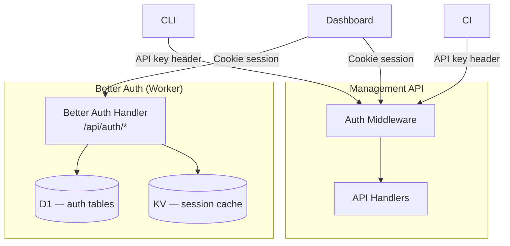
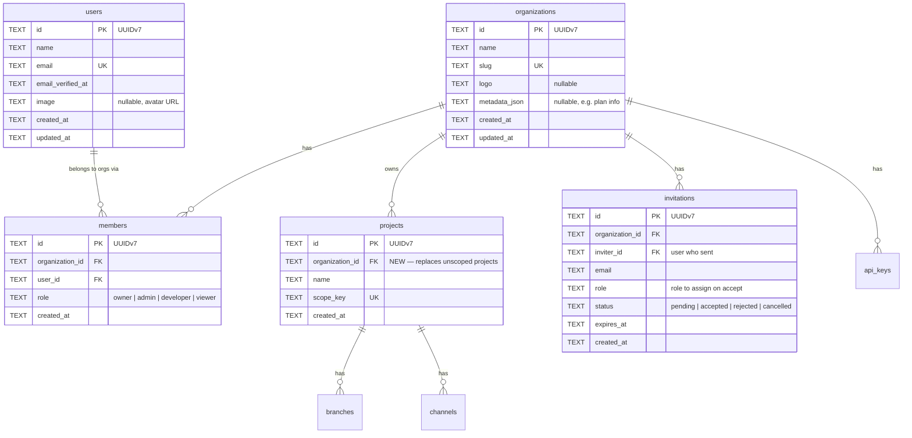
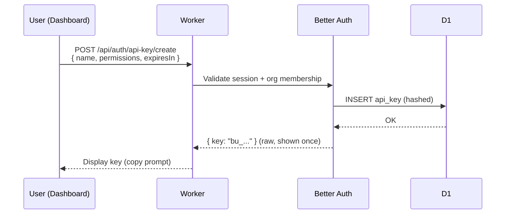
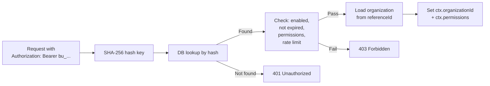
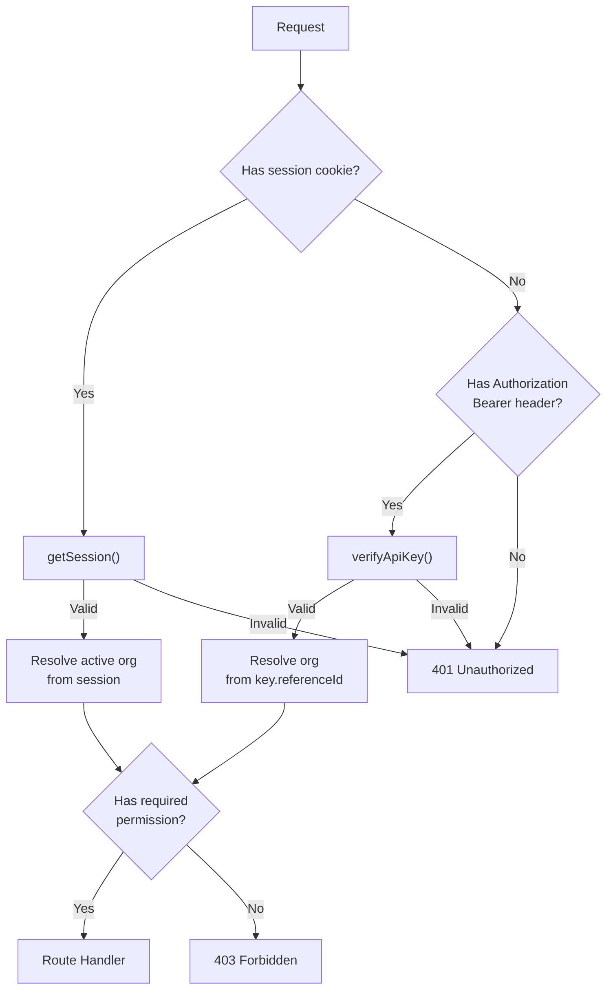
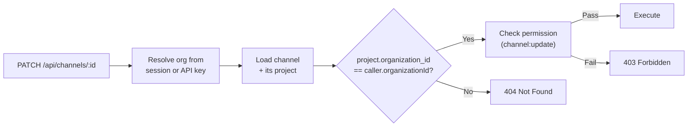

# 21. Authentication & Authorization

Better Auth integration for multi-organization authentication, role-based access control, and API key management — modeled after the EAS dashboard access model.

---

## 1. Overview

The current system uses a single shared API key (Worker secret) for all management API access. This spec replaces that with:

- **Session-based auth** for the dashboard (email/password + OAuth)
- **Organization-scoped API keys** for CLI/CI (replacing the global API key)
- **Role-based access control** at the organization level
- **Organization → Project ownership** (projects belong to orgs, not individual users)



Protocol endpoints (`/manifest/:projectId`, `/assets/*`) remain **unauthenticated** — no change from current behavior.

---

## 2. Organization Model

### Hierarchy



### Key Change: Projects Belong to Organizations

The existing `projects` table gains an `organization_id` foreign key. All projects must belong to exactly one organization.

Migration: `ALTER TABLE projects ADD COLUMN organization_id TEXT REFERENCES organizations(id);`

After creating the first organization, backfill existing projects and add `NOT NULL` constraint.

---

## 3. Roles & Permissions

Four roles, modeled after EAS:

| Role          | Projects | Branches/Channels | Publish | Rollback/Rollout | Members | Billing | Org Settings |
| ------------- | -------- | ----------------- | ------- | ---------------- | ------- | ------- | ------------ |
| **Owner**     | CRUD     | CRUD              | Yes     | Yes              | CRUD    | Yes     | Yes          |
| **Admin**     | CRUD     | CRUD              | Yes     | Yes              | CRU\*   | Yes     | Read         |
| **Developer** | Create   | CRUD              | Yes     | Yes              | Read    | No      | No           |
| **Viewer**    | Read     | Read              | No      | No               | Read    | No      | No           |

\* Admins can invite/remove members up to Admin role. Cannot grant Owner.

### Permission Map (Better Auth format)

```typescript
const permissions = {
  owner: {
    organization: ["read", "update", "delete"],
    member: ["read", "create", "update", "delete"],
    invitation: ["read", "create", "cancel"],
    project: ["read", "create", "update", "delete"],
    channel: ["read", "create", "update", "delete"],
    branch: ["read", "create", "update", "delete"],
    update: ["read", "create", "delete"],
    rollout: ["read", "create", "update", "delete"],
    billing: ["read", "update"],
    apiKey: ["read", "create", "delete"],
  },
  admin: {
    organization: ["read"],
    member: ["read", "create", "update", "delete"],
    invitation: ["read", "create", "cancel"],
    project: ["read", "create", "update", "delete"],
    channel: ["read", "create", "update", "delete"],
    branch: ["read", "create", "update", "delete"],
    update: ["read", "create", "delete"],
    rollout: ["read", "create", "update", "delete"],
    billing: ["read", "update"],
    apiKey: ["read", "create", "delete"],
  },
  developer: {
    project: ["read", "create"],
    channel: ["read", "create", "update", "delete"],
    branch: ["read", "create", "update", "delete"],
    update: ["read", "create", "delete"],
    rollout: ["read", "create", "update", "delete"],
    apiKey: ["read"],
  },
  viewer: {
    organization: ["read"],
    member: ["read"],
    project: ["read"],
    channel: ["read"],
    branch: ["read"],
    update: ["read"],
    rollout: ["read"],
  },
} as const;
```

### No Per-Project Access Control

Like EAS, roles are organization-wide. A Developer in an org has Developer access to **all** projects in that org. Per-project restrictions are out of scope — use separate organizations for project-level isolation.

---

## 4. Authentication Methods

### 4.1 Session Auth (Dashboard)

Better Auth handles the full auth flow. The Worker mounts Better Auth at `/api/auth/*`.

```typescript
import { betterAuth } from "better-auth";
import { organization } from "better-auth/plugins";
import { apiKey } from "@better-auth/api-key";

type Env = {
  DB: D1Database;
  SESSION_KV: KVNamespace;
  BETTER_AUTH_SECRET: string;
  BETTER_AUTH_URL: string;
  GITHUB_CLIENT_ID: string;
  GITHUB_CLIENT_SECRET: string;
  GOOGLE_CLIENT_ID: string;
  GOOGLE_CLIENT_SECRET: string;
};

export function createAuth(env: Env) {
  return betterAuth({
    secret: env.BETTER_AUTH_SECRET,
    baseURL: env.BETTER_AUTH_URL,
    database: {
      db: new Kysely({ dialect: new D1Dialect({ database: env.DB }) }),
      type: "sqlite",
    },

    emailAndPassword: { enabled: true },
    // Each provider is feature-gated: included only when both its client ID
    // and secret are present, so an unconfigured provider stays disabled.
    socialProviders: {
      github: {
        clientId: env.GITHUB_CLIENT_ID,
        clientSecret: env.GITHUB_CLIENT_SECRET,
      },
      google: {
        clientId: env.GOOGLE_CLIENT_ID,
        clientSecret: env.GOOGLE_CLIENT_SECRET,
      },
    },

    session: {
      expiresIn: 60 * 60 * 24 * 7, // 7 days
      updateAge: 60 * 60 * 24, // refresh daily
      cookieCache: {
        enabled: true,
        maxAge: 300, // 5 min cookie cache
        strategy: "compact",
      },
    },

    secondaryStorage: {
      get: (key) => env.SESSION_KV.get(key),
      set: (key, value, ttl) => env.SESSION_KV.put(key, value, { expirationTtl: ttl }),
      delete: (key) => env.SESSION_KV.delete(key),
    },

    plugins: [
      organization({
        allowUserToCreateOrganization: true,
        organizationLimit: 5,
        membershipLimit: 100,
        creatorRole: "owner",
      }),
      apiKey([
        {
          configId: "org-secret",
          defaultPrefix: "bu_",
          references: "organization",
          enableMetadata: true,
          keyExpiration: {
            defaultExpiresIn: null, // no default expiry
            minExpiresIn: 86_400, // min 1 day
          },
          rateLimit: {
            enabled: true,
            timeWindow: 60_000, // 1 min window
            maxRequests: 120,
          },
        },
      ]),
    ],

    advanced: {
      database: { disableTransactions: true }, // D1 limitation
      useSecureCookies: true,
      backgroundTasks: {
        handler: (promise) => globalThis.waitUntilPromises?.push(promise),
      },
    },
  });
}
```

### 4.2 API Key Auth (CLI/CI)

Organization-scoped API keys replace the current global Worker secret. Keys are created via the dashboard or management API, scoped to an organization with specific permissions.

**Header:** `Authorization: Bearer bu_...`

**Creation flow:**



**Verification flow (on every management API request):**



### 4.3 Auth Middleware

A unified middleware resolves the caller identity from either session cookie or API key, then enforces organization membership and permissions.



**Organization resolution for management API:**

| Auth method | Organization resolution                                             |
| ----------- | ------------------------------------------------------------------- |
| Session     | Active organization from session (set via `organization.setActive`) |
| API key     | `referenceId` on the API key record (always an organization ID)     |

All management API endpoints require an organization context. Requests without one return `400 Bad Request`.

---

## 5. API Key Permissions for Management Endpoints

Each management API endpoint maps to a required permission. The middleware checks the API key's stored permissions against the required permission before allowing the request.

| Endpoint                               | Required Permission |
| -------------------------------------- | ------------------- |
| `POST /api/projects`                   | `project:create`    |
| `GET /api/projects`                    | `project:read`      |
| `POST /api/branches`                   | `branch:create`     |
| `GET /api/branches`                    | `branch:read`       |
| `PATCH /api/branches/:id`              | `branch:update`     |
| `POST /api/channels`                   | `channel:create`    |
| `PATCH /api/channels/:id`              | `channel:update`    |
| `GET /api/channels`                    | `channel:read`      |
| `POST /api/channels/:id/pause`         | `channel:update`    |
| `POST /api/channels/:id/resume`        | `channel:update`    |
| `POST /api/assets/upload`              | `update:create`     |
| `POST /api/updates`                    | `update:create`     |
| `GET /api/updates`                     | `update:read`       |
| `DELETE /api/updates/:groupId`         | `update:delete`     |
| `POST /api/updates/republish`          | `update:create`     |
| `POST /api/channels/:id/rollout`       | `rollout:create`    |
| `PATCH /api/channels/:id/rollout`      | `rollout:update`    |
| `DELETE /api/channels/:id/rollout`     | `rollout:delete`    |
| `PATCH /api/updates/:id/rollout`       | `rollout:update`    |
| `POST /api/updates/:id/revert-rollout` | `rollout:update`    |
| `DELETE /api/updates/:id/rollout`      | `rollout:delete`    |
| `GET /api/analytics/adoption`          | `project:read`      |
| `GET /api/analytics/updates`           | `project:read`      |
| `GET /api/analytics/channels`          | `project:read`      |
| `GET /api/analytics/platforms`         | `project:read`      |

The middleware also enforces **project ownership** — the requested project must belong to the caller's organization. This prevents cross-org access even if permissions are satisfied.

---

## 6. Cloudflare Integration

### D1 Considerations

| Concern                            | Solution                                                                                                             |
| ---------------------------------- | -------------------------------------------------------------------------------------------------------------------- |
| No interactive transactions        | `disableTransactions: true` in Better Auth config                                                                    |
| D1 binding only in request context | Factory function `createAuth(env)` — lazy singleton per isolate                                                      |
| Schema migration                   | Programmatic via `getMigrations(auth.options).runMigrations()` on first deploy, or export SQL and apply via Wrangler |
| `nodejs_compat` required           | Better Auth uses `AsyncLocalStorage` — add `compatibility_flags = ["nodejs_compat"]` in `wrangler.toml`              |

### KV for Session Storage

Sessions are stored in KV via `secondaryStorage` instead of D1. This avoids D1 read latency on every authenticated request and keeps session checks at sub-millisecond edge latency.

| KV Key            | Value               | TTL                          |
| ----------------- | ------------------- | ---------------------------- |
| `session:{token}` | JSON session object | `session.expiresIn` (7 days) |

### Cookie Cache

With `cookieCache.strategy: "compact"`, the session is cached in a signed cookie for 5 minutes. During this window, the middleware reads the session from the cookie without hitting KV or D1 — making auth overhead ~0ms for most requests.

### Wrangler Bindings

New bindings required:

```toml
compatibility_flags = ["nodejs_compat"]

[[kv_namespaces]]
binding = "SESSION_KV"
id = "<kv-namespace-id>"

[vars]
BETTER_AUTH_URL = "https://api.updates.example.com"

# Secrets (via `wrangler secret put`):
# BETTER_AUTH_SECRET
# GITHUB_CLIENT_ID
# GITHUB_CLIENT_SECRET
# GOOGLE_CLIENT_ID
# GOOGLE_CLIENT_SECRET
```

---

## 7. Auth Endpoints

Better Auth mounts at `/api/auth/*`. Key endpoints:

### Session Auth

| Method | Path                       | Purpose                      |
| ------ | -------------------------- | ---------------------------- |
| POST   | `/api/auth/sign-up/email`  | Register with email/password |
| POST   | `/api/auth/sign-in/email`  | Login with email/password    |
| POST   | `/api/auth/sign-in/social` | OAuth login (GitHub)         |
| GET    | `/api/auth/session`        | Get current session          |
| POST   | `/api/auth/sign-out`       | Logout                       |
| GET    | `/api/auth/ok`             | Health check                 |

### Organization Management

| Method | Path                                        | Purpose                            |
| ------ | ------------------------------------------- | ---------------------------------- |
| POST   | `/api/auth/organization/create`             | Create organization                |
| POST   | `/api/auth/organization/set-active`         | Set active org for session         |
| GET    | `/api/auth/organization/full`               | Get org with members & invitations |
| GET    | `/api/auth/organization/list`               | List user's organizations          |
| POST   | `/api/auth/organization/invite-member`      | Send invitation                    |
| POST   | `/api/auth/organization/accept-invitation`  | Accept invitation                  |
| PATCH  | `/api/auth/organization/update-member-role` | Change member role                 |
| DELETE | `/api/auth/organization/remove-member`      | Remove member                      |
| GET    | `/api/auth/organization/has-permission`     | Check caller permission            |

### API Key Management

| Method | Path                       | Purpose                   |
| ------ | -------------------------- | ------------------------- |
| POST   | `/api/auth/api-key/create` | Create org-scoped API key |
| GET    | `/api/auth/api-key/list`   | List keys for active org  |
| POST   | `/api/auth/api-key/verify` | Verify a key              |
| DELETE | `/api/auth/api-key/delete` | Revoke a key              |

---

## 8. Data Model Changes

### New Tables (managed by Better Auth)

Better Auth auto-creates these tables via migration:

| Table           | Purpose                                 | Managed By          |
| --------------- | --------------------------------------- | ------------------- |
| `users`         | User accounts                           | Better Auth core    |
| `sessions`      | Session records (backup, primary in KV) | Better Auth core    |
| `accounts`      | OAuth provider links                    | Better Auth core    |
| `verifications` | Email verification tokens               | Better Auth core    |
| `organizations` | Organizations                           | Organization plugin |
| `members`       | Org membership + role                   | Organization plugin |
| `invitations`   | Pending invitations                     | Organization plugin |
| `api_keys`      | Hashed API keys with permissions        | API key plugin      |

### Modified Tables

| Table      | Change                                                  | Migration                                               |
| ---------- | ------------------------------------------------------- | ------------------------------------------------------- |
| `projects` | Add `organization_id TEXT REFERENCES organizations(id)` | `ALTER TABLE projects ADD COLUMN organization_id TEXT;` |

### New Index

| Index              | Columns           | Purpose                       |
| ------------------ | ----------------- | ----------------------------- |
| `idx_projects_org` | `organization_id` | List projects by organization |

---

## 9. Migration Strategy

### Phase 1: Add Better Auth (non-breaking)

1. Add Better Auth dependencies and configure with D1 + KV
2. Run schema migration (creates auth tables)
3. Mount `/api/auth/*` endpoints on the Worker
4. Existing API key auth (`Authorization: Bearer <secret>`) continues working unchanged

### Phase 2: Organization + API Key Support

1. Add `organization_id` column to `projects` (nullable initially)
2. Create the first organization via seed script or admin API
3. Backfill existing projects with the organization ID
4. Add `NOT NULL` constraint to `organization_id`
5. Enable org-scoped API key creation via dashboard

### Phase 3: Auth Middleware Replacement

1. Deploy unified auth middleware (session + API key)
2. Management API checks organization context on all requests
3. Deprecate the global Worker secret
4. Remove the old `Authorization: Bearer <secret>` code path

### Phase 4: Dashboard Auth

1. Dashboard sign-up/sign-in pages
2. Organization switcher
3. Member management UI
4. API key management UI (create, list, revoke)

---

## 10. Security

### Rate Limiting

| Endpoint Category       | Window | Max Requests |
| ----------------------- | ------ | ------------ |
| Sign-in/sign-up         | 60s    | 5            |
| Password reset          | 60s    | 3            |
| API key verification    | 60s    | 120          |
| Organization management | 60s    | 30           |
| General auth endpoints  | 10s    | 100          |

### API Key Security

- Keys are stored as **SHA-256 hashes** — the raw key is never persisted
- Only the first 6 characters are stored (`start` field) for UI identification
- Raw key is returned **once** on creation — cannot be retrieved again
- Expired keys are automatically purged on access
- Keys with exhausted `remaining` quota are auto-deleted (unless refill is configured)

### Session Security

- Cookies: `Secure`, `HttpOnly`, `SameSite=Lax`, `__Secure-` prefix
- Session cached in signed cookie (compact strategy) for 5 min — reduces KV reads
- Session refresh every 24 hours — extends expiry on active use
- `trustedOrigins` configured for dashboard domain only

### CSRF

Better Auth's built-in CSRF protection (origin header validation + Fetch Metadata) is enabled by default. No additional CSRF tokens needed.

### Organization Ownership Enforcement

Every management API request verifies that the target resource (project, channel, branch, update) belongs to the caller's organization. This is a DB-level check — not just permission-based:



Resources outside the caller's organization return `404` (not `403`) to prevent organization enumeration.
